# stb-image Architecture

> Version v2.0.0 | 196 public functions + 27 types | 847 tests + 75 benchmarks
>
> [English](ARCHITECTURE.en.md) | [中文](ARCHITECTURE.md)

## Overview

stb-image is a MoonBit native FFI binding library that wraps the [stb](https://github.com/nothings/stb) series of single-header libraries, providing full image decode/encode/resize/process capabilities. It adopts an eight-subpackage architecture (types, core, lib, pure, process, format, meta, util), with the root package re-exporting to maintain a backward-compatible API.

## Feature Categories

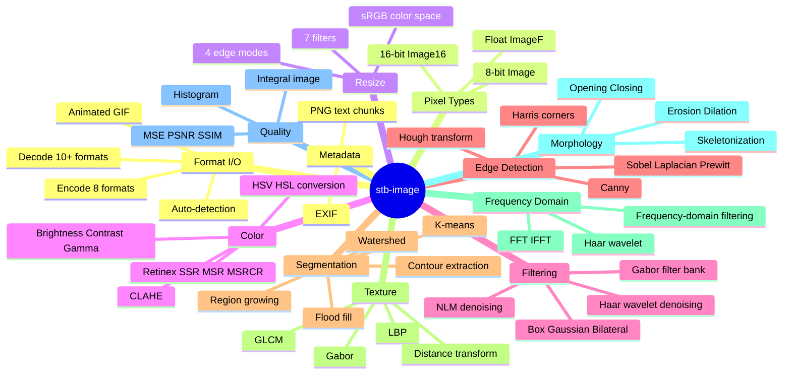

## Package Structure Overview

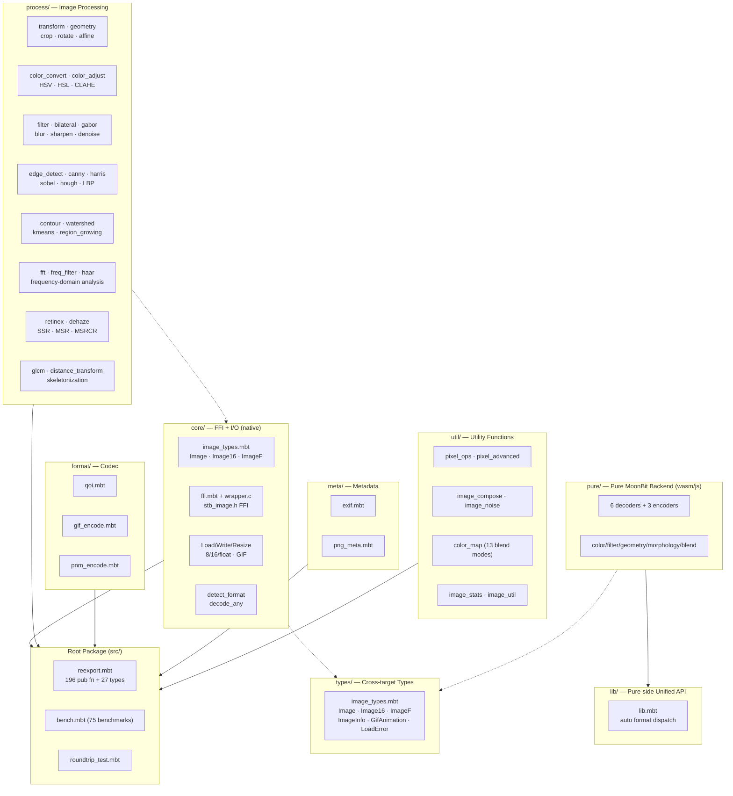

## Package Dependencies

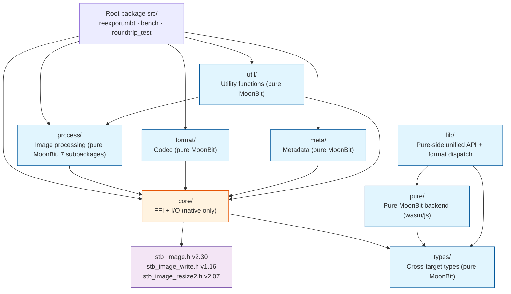

## FFI Boundary

```mermaid
flowchart LR
    subgraph MoonBit["MoonBit Layer"]
        Types["image_types.mbt<br/>Image · Image16 · ImageF"]
        FFI["ffi.mbt<br/>extern \"c\" declarations"]
        Native["image_*_native.mbt<br/>load/write/resize"]
    end

    subgraph C["C Layer"]
        Wrapper["wrapper.c<br/>ABI standardization"]
        Stb["stb_image*.h<br/>single-header libraries"]
    end

    Types --> Native
    Native --> FFI
    FFI --> Wrapper
    Wrapper --> Stb

    subgraph Memory["Memory Management"]
        Alloc["stbi_malloc<br/>C allocation"]
        Copy["memcpy<br/>C → MoonBit Bytes"]
        Free["stbi_image_free<br/>C release"]
    end

    Stb --> Alloc
    Alloc --> Copy
    Copy --> Free
```

**FFI Constraints**:
- All pixel data is copied from C buffers to MoonBit `Bytes` via `memcpy` (no zero-copy)
- `wrapper.c` handles ABI standardization: converts stb's `unsigned char*` return values to MoonBit-readable `Bytes`
- Closures cannot be passed as C function pointers (`stbi_io_callbacks` not implemented)

## Subpackage Details

### core/ — FFI + Types + I/O

```mermaid
flowchart TB
    subgraph CorePkg["core/ (FFI Boundary)"]
        direction TB
        Types["image_types.mbt<br/>Image · Image16 · ImageF<br/>ImageInfo · GifAnimation · LoadError<br/>ImageFormat · ResizeFilter · ResizeEdge"]
        FFI["ffi.mbt<br/>private extern \"c\" declarations"]
        Wrapper["wrapper.c<br/>C ABI wrapper"]
        Load["image_load_native.mbt<br/>load_from_path/bytes<br/>load_16_* · loadf_* · load_gif_*"]
        Write["image_write_native.mbt<br/>write_png/bmp/tga/jpeg/hdr"]
        Resize["image_resize_native.mbt<br/>resize · resize_16 · resizef · resize_srgb"]
        Info["image_info_native.mbt<br/>info_from_path/bytes<br/>is_16_bit · is_hdr"]
        Detect["image_detect.mbt<br/>detect_format · decode_any<br/>is_supported_format"]
        Icon["icon_encode.mbt<br/>encode_ico · encode_icns"]
        Config["image_config.mbt<br/>flip · unpremultiply · HDR gamma/scale"]
    end
```

**Responsibilities**: All C FFI interactions, pixel type definitions, load/write/resize/detect/config

**Key Designs**:
- `Image.data : Bytes` — Pixel data is stored in MoonBit-managed `Bytes`; C-side allocations are copied immediately and then freed
- `LoadError` — Three error variants: `FileIO` / `UnsupportedFormat` / `DecodeFailed`
- `req_channels` — Optional parameter to force output channel count (1=grayscale, 2=grayscale+Alpha, 3=RGB, 4=RGBA)

### process/ — Image Processing

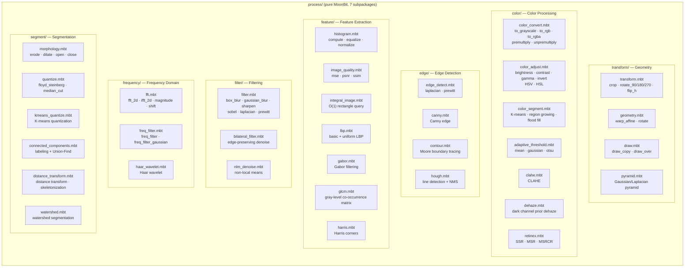

**Responsibilities**: All pure MoonBit image processing algorithms, no FFI dependencies

**Key Designs**:
- Only depends on `@core` (type definitions) and `@math` (math functions)
- All functions accept `Image` and return `Image`, supporting function composition
- 17 of the 27 types are defined in this package (`Complex`, `FFTResult`, `FreqFilterType`, `ConnectedComponent`, ...)

### format/ — Codec

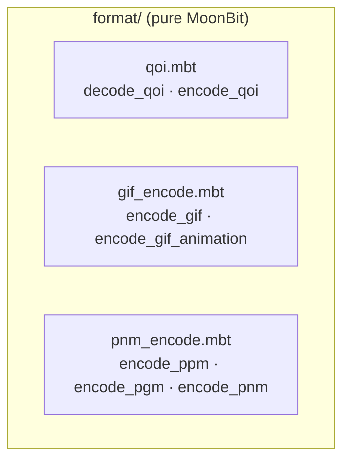

**Responsibilities**: Pure MoonBit codec for QOI/GIF/PNM formats

### meta/ — Metadata

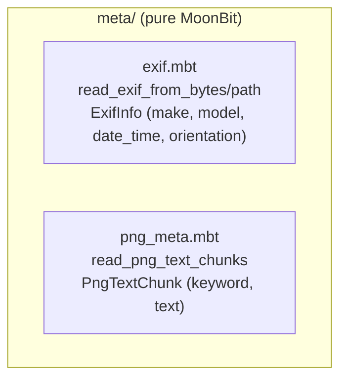

**Responsibilities**: EXIF and PNG text chunk metadata reading

### util/ — Utility Functions

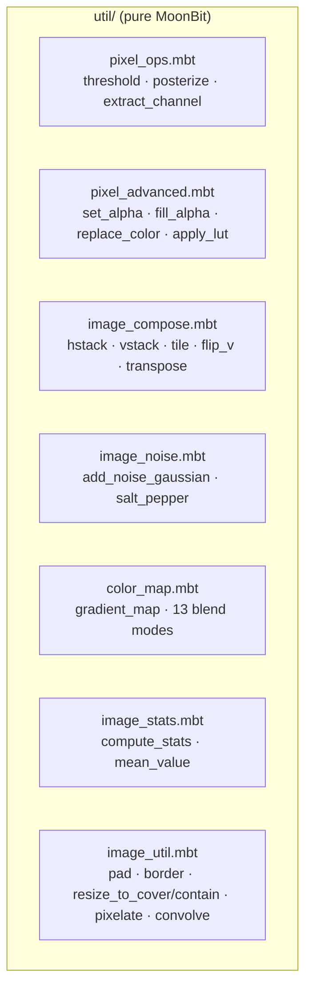

**Responsibilities**: Utility functions for pixel operations, image composition, noise, color mapping, statistics, etc.

## Data Flow

### Processing Pipeline Overview

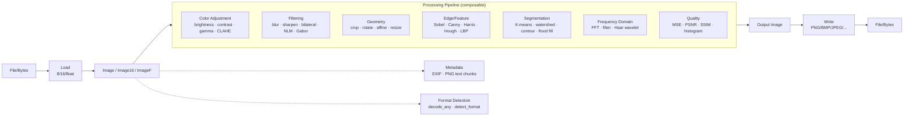

### Load-Process-Write Sequence Diagram

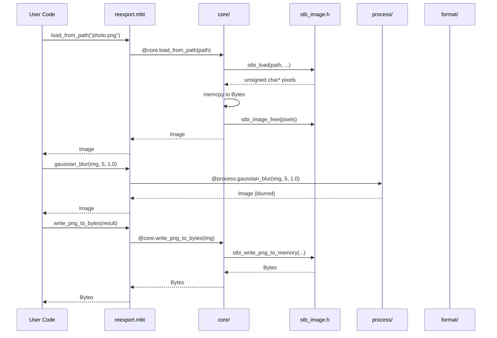

### Format Detection Flow

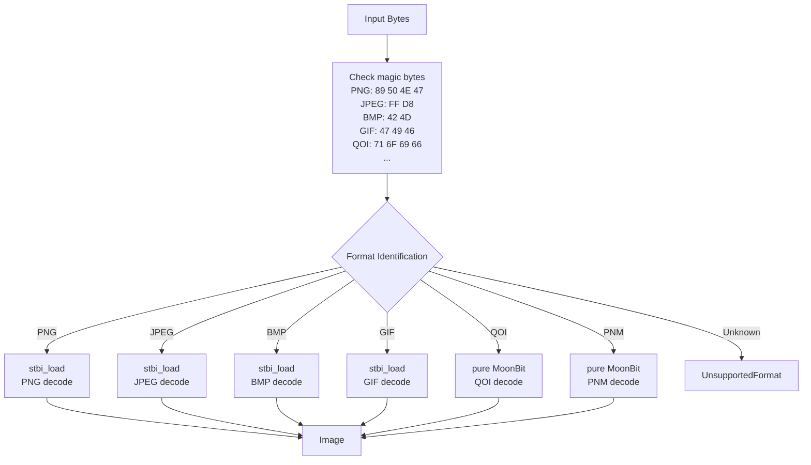

## API Classification

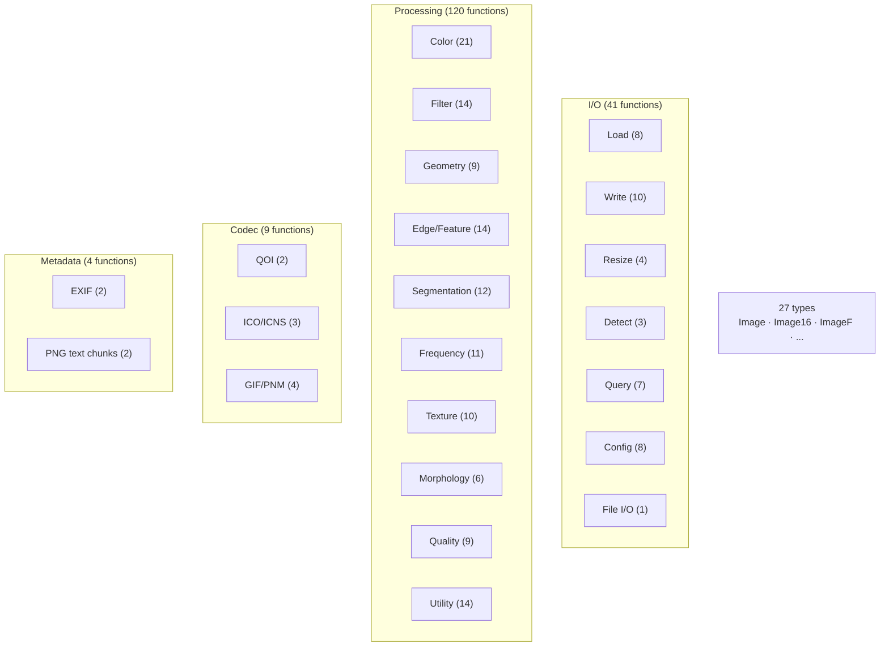

## Type System

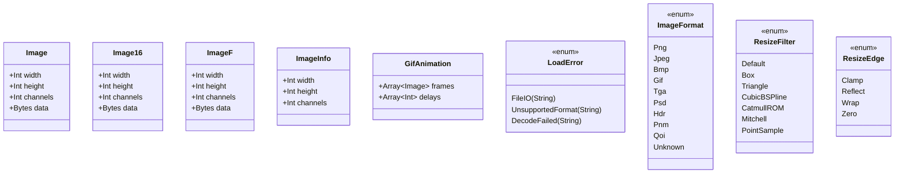

## Project Structure

```
stb-image/
├── moon.mod                  # Module config (v2.0.0, preferred_target = native)
├── ARCHITECTURE.md           # Architecture doc (Chinese)
├── ARCHITECTURE.en.md        # Architecture doc (English, this file)
├── API.md                    # Full API reference
├── CHANGELOG.md              # Version history
├── ROADMAP.md                # Iteration roadmap
├── COMPARISON.md             # mooncakes.io image library comparison
├── SKILL.md                  # Package usage guide
├── src/
│   ├── moon.pkg              # Root package: re-export + benchmarks + roundtrip tests
│   ├── reexport.mbt          # Backward-compatible API (196 pub fn + 27 types)
│   ├── bench.mbt             # 75 performance benchmarks
│   ├── roundtrip_test.mbt    # Full-format roundtrip tests
│   ├── types/                # Cross-target types (Image/Image16/ImageF/ImageInfo etc.)
│   │   ├── moon.pkg          # imports @debug
│   │   └── image_types.mbt   # Shared type definitions across targets
│   ├── core/                 # Core: FFI + load/write/resize + detect + ICO (native only)
│   │   ├── moon.pkg          # native-stub: wrapper.c
│   │   ├── image_types.mbt   # Image, Image16, ImageF, ImageInfo, GifAnimation, LoadError
│   │   ├── ffi.mbt           # private extern "c" declarations
│   │   ├── wrapper.c         # C FFI wrapper (ABI standardization)
│   │   ├── stb_image*.h      # Third-party upstream headers
│   │   ├── image_*_native.mbt# load/write/resize/info/gif/16/float
│   │   ├── image_detect.mbt  # detect_format/decode_any/is_supported_format
│   │   ├── icon_encode.mbt   # encode_ico/encode_ico_sizes/encode_icns
│   │   └── *_test.mbt        # Core tests
│   ├── process/              # Image processing (pure MoonBit, 7 subpackages)
│   │   ├── moon.pkg          # Empty placeholder package
│   │   ├── transform/        # crop/rotate/flip/pyramid/draw
│   │   ├── color/            # color convert/adjust/CLAHE/Retinex/dehaze/segment/threshold
│   │   ├── filter/           # blur/sharpen/bilateral/NLM/Gabor
│   │   ├── edge/             # Sobel/Laplacian/Prewitt/Canny/Hough/contour
│   │   ├── frequency/        # FFT/frequency filter/Haar wavelet
│   │   ├── feature/          # histogram/integral image/GLCM/Harris/LBP/quality
│   │   └── segment/          # morphology/quantize/connected components/watershed/distance
│   ├── format/               # Format codec (pure MoonBit)
│   │   ├── moon.pkg          # imports @core
│   │   ├── qoi.mbt           # decode_qoi/encode_qoi
│   │   ├── gif_encode.mbt    # encode_gif/encode_gif_animation
│   │   ├── pnm_encode.mbt    # encode_ppm/encode_pgm/encode_pnm
│   │   └── *_test.mbt        # Format tests
│   ├── meta/                 # Metadata (pure MoonBit)
│   │   ├── moon.pkg          # imports @core
│   │   ├── exif.mbt          # read_exif_from_bytes/read_exif_from_path
│   │   ├── png_meta.mbt      # read_png_text_chunks/...
│   │   └── *_test.mbt        # Metadata tests
│   ├── util/                 # Utility functions (pure MoonBit)
│   │   ├── moon.pkg          # imports @core, @process
│   │   ├── image_util.mbt    # pad/border/resize_to_cover/contain/pixelate/...
│   │   ├── pixel_ops.mbt     # threshold/posterize/extract_channel/swap_channels
│   │   ├── pixel_advanced.mbt# set_alpha/fill_alpha/replace_color/apply_lut
│   │   ├── image_stats.mbt   # compute_stats/mean_value
│   │   ├── image_compose.mbt # hstack/vstack/tile/flip_vertical/transpose
│   │   ├── image_noise.mbt   # add_noise_gaussian/add_noise_salt_pepper
│   │   ├── color_map.mbt     # gradient_map/blend_*
│   │   └── *_test.mbt        # Utility tests
│   ├── pure/                 # Pure MoonBit backend (wasm/js targets)
│   │   ├── moon.pkg          # imports @types, @math, @encoding/utf8, @debug
│   │   ├── bmp_decode.mbt    # BMP decode
│   │   ├── qoi_decode.mbt    # QOI decode/encode
│   │   ├── tga_decode.mbt    # TGA decode
│   │   ├── pnm_decode.mbt    # PNM decode/encode
│   │   ├── psd_decode.mbt    # PSD decode
│   │   ├── gif_decode.mbt    # GIF decode/encode
│   │   ├── color_adjust.mbt  # color adjustment
│   │   ├── color_convert.mbt # color conversion
│   │   ├── filter.mbt        # filter/edge detect
│   │   ├── geometry.mbt      # geometry transform
│   │   ├── transform.mbt     # rotate/flip
│   │   ├── histogram.mbt     # histogram
│   │   ├── morphology.mbt    # morphology
│   │   ├── pixel_ops.mbt     # pixel operations
│   │   ├── pixel_advanced.mbt# advanced pixel ops
│   │   ├── image_compose.mbt # image composition
│   │   ├── image_noise.mbt   # noise
│   │   ├── image_stats.mbt   # statistics
│   │   ├── image_util.mbt    # utilities
│   │   ├── color_map.mbt     # color mapping
│   │   ├── blend.mbt         # 13 blend modes
│   │   └── *_test.mbt        # pure backend tests
│   └── lib/                  # Pure-side unified API + auto format dispatch
│       ├── moon.pkg          # imports @types, @pure
│       ├── lib.mbt           # unified entry + auto format dispatch
│       └── lib_test.mbt      # lib tests
├── scripts/
│   ├── prepare.py            # Third-party code preparation script
│   ├── gen_testdata.py       # Test image generator
│   ├── run-asan.py           # ASan validation
│   └── gen_reexport.py       # Re-export file generator
└── testdata/                 # Test images (PNG/BMP/GIF/JPG + corrupted files)
```

## Design Decisions

### 1. Five-Subpackage Architecture (v1.10.1)

**Problem**: Single package exceeded 30 source files, slow compilation, unclear responsibilities

**Solution**: Split by responsibility into `core` (FFI) / `process` (processing) / `format` (codec) / `meta` (metadata) / `util` (utilities), with root package re-exporting to maintain API compatibility

**Benefits**: Parallelized compilation, clear responsibilities, independent testing

### 2. Re-export Strategy

**Problem**: `pub let` cannot re-export functions with labeled parameters

**Solution**: Plain functions use `pub let` for direct aliasing; functions with labeled parameters use `pub fn` wrappers to preserve default values

### 3. FFI Memory Management

**Problem**: Memory boundary between MoonBit GC and C malloc

**Solution**: C-side allocation → `memcpy` to MoonBit `Bytes` → immediate `stbi_image_free`. No zero-copy, but safe and simple

### 4. Pure MoonBit vs FFI

**Principle**:
- Features already in stb → FFI bindings (low cost, high quality, ASan-verifiable)
- Features not in stb → pure MoonBit implementation (placed in `process/` or `format/`)
- Format codec: QOI/GIF/PNM use pure MoonBit; PNG/JPEG/BMP/TGA/HDR use FFI

### 5. `pub(all) struct` vs `pub struct`

**Problem**: Tests need to construct struct instances

**Solution**: Types requiring external construction use `pub(all) struct` (e.g., `HoughLine`, `Contour`, `CornerPoint`); internal-only types use `pub struct`

## Performance Characteristics

| Operation | Complexity | Notes |
|-----------|-----------|-------|
| Load/Write | O(n) | n = pixel count, FFI call |
| Resize | O(n) | FFI stb_image_resize2 |
| box_blur | O(n) | sliding window optimization |
| gaussian_blur | O(n × r) | separable kernel, r = radius |
| bilateral_filter | O(n × r²) | r = radius |
| bilateral_filter_fast | O(n × r² / s²) | s = downsampling factor |
| nlm_denoise | O(n × s² × p²) | s = search window, p = patch size |
| fft_2d | O(n log n) | Cooley-Tukey radix-2 |
| connected_components | O(n × α(n)) | Union-Find, α ≈ 4 |
| integral_image | O(n) | preprocessing |
| integral_sum/mean/variance | O(1) | rectangle query |
| distance_transform | O(n) | two-pass scan |
| hough_lines | O(n × θ) | θ = angle resolution |
| watershed | O(n log n) | priority queue |
| dehaze | O(n × p²) | p = dark channel patch size |