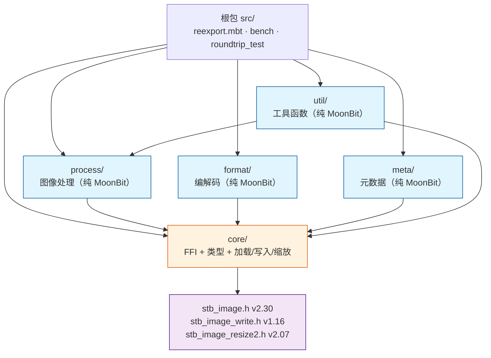
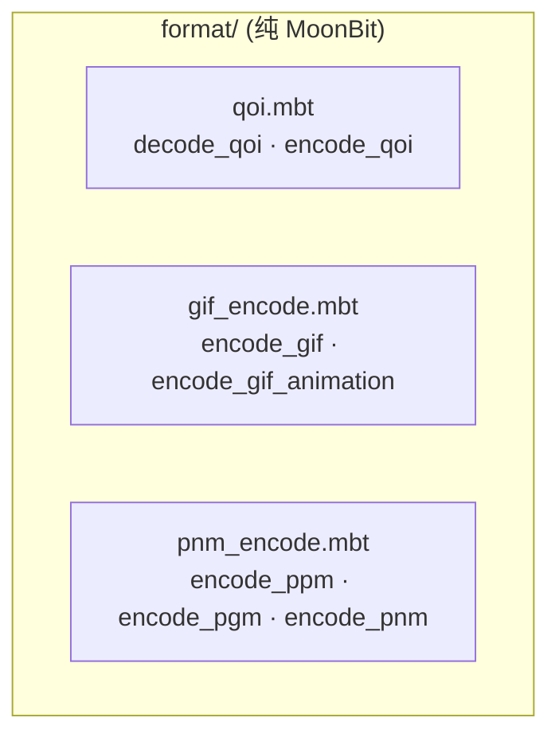
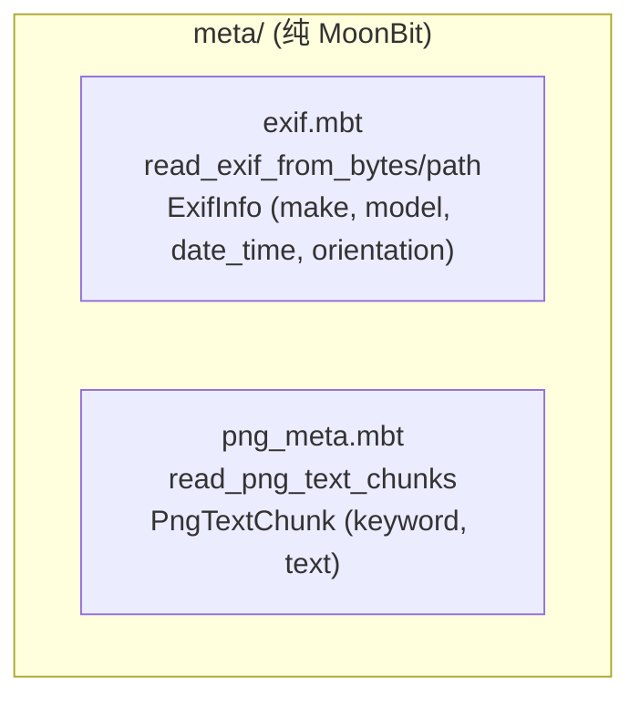
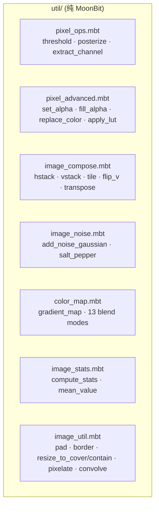
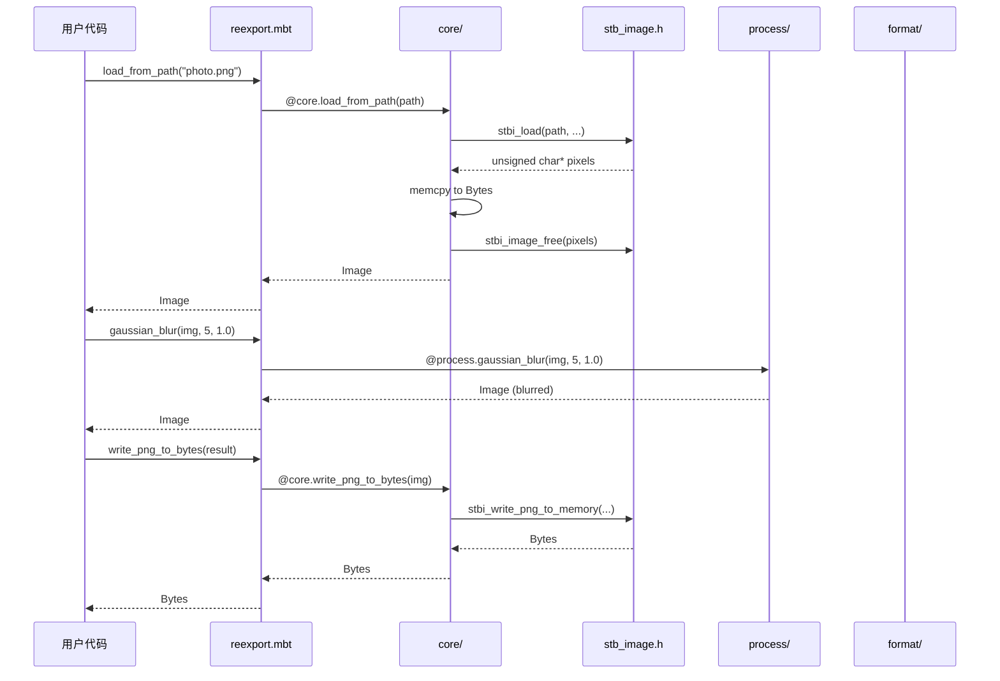
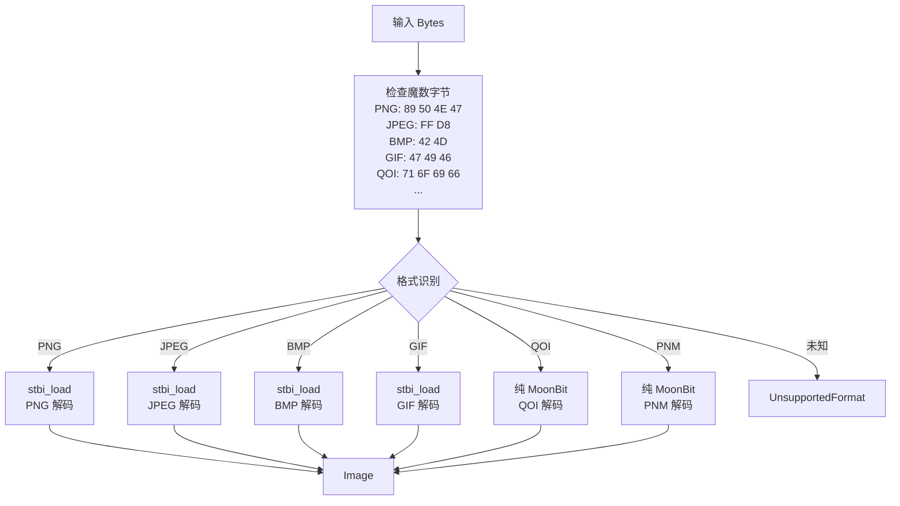
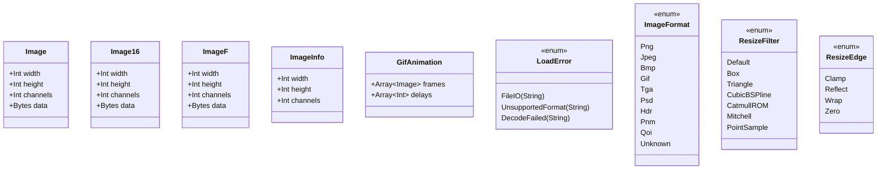

# stb-image 架构文档

> 版本 v1.17.0 | 199 公开函数 + 29 类型 | 533 测试 + 29 基准测试

## 概述

stb-image 是 MoonBit 原生 FFI 绑定库，封装 [stb](https://github.com/nothings/stb) 系列单头文件库，提供完整的图像解码/编码/缩放/处理能力。采用五子包架构，根包 re-export 保持向后兼容 API。

## 包依赖关系



## FFI 边界

```mermaid
flowchart LR
    subgraph MoonBit["MoonBit 层"]
        Types["image_types.mbt<br/>Image · Image16 · ImageF"]
        FFI["ffi.mbt<br/>extern \"c\" 声明"]
        Native["image_*_native.mbt<br/>加载/写入/缩放"]
    end

    subgraph C["C 层"]
        Wrapper["wrapper.c<br/>ABI 标准化"]
        Stb["stb_image*.h<br/>单头文件库"]
    end

    Types --> Native
    Native --> FFI
    FFI --> Wrapper
    Wrapper --> Stb

    subgraph Memory["内存管理"]
        Alloc["stbi_malloc<br/>C 分配"]
        Copy["memcpy<br/>C → MoonBit Bytes"]
        Free["stbi_image_free<br/>C 释放"]
    end

    Stb --> Alloc
    Alloc --> Copy
    Copy --> Free
```

**FFI 约束**：
- 所有像素数据通过 `memcpy` 从 C 缓冲区复制到 MoonBit `Bytes`（无零拷贝）
- `wrapper.c` 负责 ABI 标准化：将 stb 的 `unsigned char*` 返回值转换为 MoonBit 可读的 `Bytes`
- 闭包无法作为 C 函数指针传递（`stbi_io_callbacks` 未实现）

## 子包详解

### core/ — FFI + 类型 + I/O

```mermaid
flowchart TB
    subgraph CorePkg["core/ (FFI 边界)"]
        direction TB
        Types["image_types.mbt<br/>Image · Image16 · ImageF<br/>ImageInfo · GifAnimation · LoadError<br/>ImageFormat · ResizeFilter · ResizeEdge"]
        FFI["ffi.mbt<br/>私有 extern \"c\" 声明"]
        Wrapper["wrapper.c<br/>C ABI 包装器"]
        Load["image_load_native.mbt<br/>load_from_path/bytes<br/>load_16_* · loadf_* · load_gif_*"]
        Write["image_write_native.mbt<br/>write_png/bmp/tga/jpeg/hdr"]
        Resize["image_resize_native.mbt<br/>resize · resize_16 · resizef · resize_srgb"]
        Info["image_info_native.mbt<br/>info_from_path/bytes<br/>is_16_bit · is_hdr"]
        Detect["image_detect.mbt<br/>detect_format · decode_any<br/>is_supported_format"]
        Icon["icon_encode.mbt<br/>encode_ico · encode_icns"]
        Config["image_config.mbt<br/>flip · unpremultiply · HDR gamma/scale"]
    end
```

**职责**：所有 C FFI 交互、像素类型定义、加载/写入/缩放/检测/配置

**关键设计**：
- `Image.data : Bytes` — 像素数据存储在 MoonBit 管理的 `Bytes` 中，C 侧分配后立即拷贝并释放
- `LoadError` — 三种错误变体：`FileIO` / `UnsupportedFormat` / `DecodeFailed`
- `req_channels` — 可选参数强制输出通道数（1=灰度, 2=灰度+Alpha, 3=RGB, 4=RGBA）

### process/ — 图像处理


**职责**：所有纯 MoonBit 图像处理算法，无 FFI 依赖

**关键设计**：
- 仅依赖 `@core`（类型定义）和 `@math`（数学函数）
- 所有函数接受 `Image` 返回 `Image`，支持函数组合
- 29 个类型中 17 个定义在此包（`Complex`, `FFTResult`, `FreqFilterType`, `ConnectedComponent`, ...）

### format/ — 编解码



**职责**：QOI/GIF/PNM 格式的纯 MoonBit 编解码

### meta/ — 元数据



**职责**：EXIF 和 PNG 文本块元数据读取

### util/ — 工具函数



**职责**：像素操作、图像合成、噪声、色彩映射、统计等工具函数

## 数据流

### 加载-处理-写入流水线



### 格式检测流程



## 类型体系



## 设计决策

### 1. 五子包架构（v1.10.1）

**问题**：单包超过 30 个源文件，编译慢、职责不清

**方案**：按职责拆分为 `core`（FFI）/ `process`（处理）/ `format`（编解码）/ `meta`（元数据）/ `util`（工具），根包 re-export 保持 API 兼容

**收益**：编译并行化、职责清晰、可独立测试

### 2. re-export 策略

**问题**：`pub let` 无法 re-export 带标签参数的函数

**方案**：普通函数用 `pub let` 直接别名，带标签参数的函数用 `pub fn` 包装器保留默认值

### 3. FFI 内存管理

**问题**：MoonBit GC 与 C malloc 的内存边界

**方案**：C 侧分配 → `memcpy` 到 MoonBit `Bytes` → 立即 `stbi_image_free`。无零拷贝，但安全简单

### 4. 纯 MoonBit vs FFI

**原则**：
- stb 已有的功能 → FFI 绑定（低成本、高质量、ASan 可验证）
- stb 没有的功能 → 纯 MoonBit 实现（放在 `process/` 或 `format/`）
- 格式编解码：QOI/GIF/PNM 用纯 MoonBit，PNG/JPEG/BMP/TGA/HDR 用 FFI

### 5. `pub(all) struct` vs `pub struct`

**问题**：测试中需要构造 struct 实例

**方案**：需要外部构造的类型用 `pub(all) struct`（如 `HoughLine`, `Contour`, `CornerPoint`），仅内部使用的用 `pub struct`

## 性能特征

| 操作 | 复杂度 | 备注 |
|------|--------|------|
| 加载/写入 | O(n) | n = 像素数，FFI 调用 |
| 缩放 | O(n) | FFI stb_image_resize2 |
| box_blur | O(n) | 滑动窗口优化 |
| gaussian_blur | O(n × r) | 可分离核，r = 半径 |
| bilateral_filter | O(n × r²) | r = 半径 |
| bilateral_filter_fast | O(n × r² / s²) | s = 降采样因子 |
| nlm_denoise | O(n × s² × p²) | s = 搜索窗口, p = 块大小 |
| fft_2d | O(n log n) | Cooley-Tukey radix-2 |
| connected_components | O(n × α(n)) | Union-Find，α ≈ 4 |
| integral_image | O(n) | 预处理 |
| integral_sum/mean/variance | O(1) | 矩形查询 |
| distance_transform | O(n) | 两遍扫描 |
| hough_lines | O(n × θ) | θ = 角度分辨率 |
| watershed | O(n log n) | 优先队列 |
| dehaze | O(n × p²) | p = 暗通道块大小 |