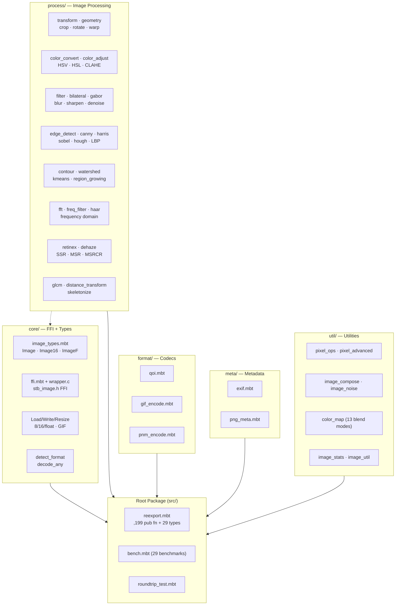
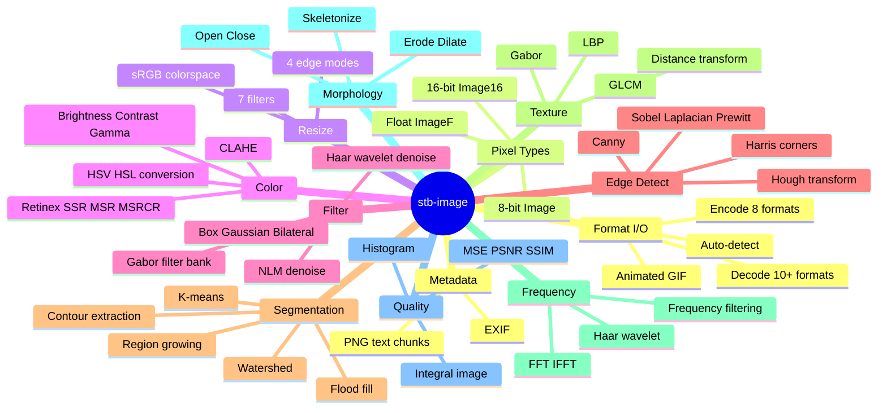
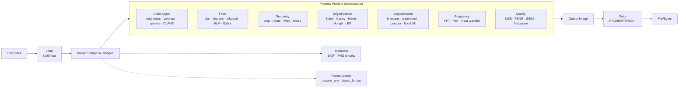
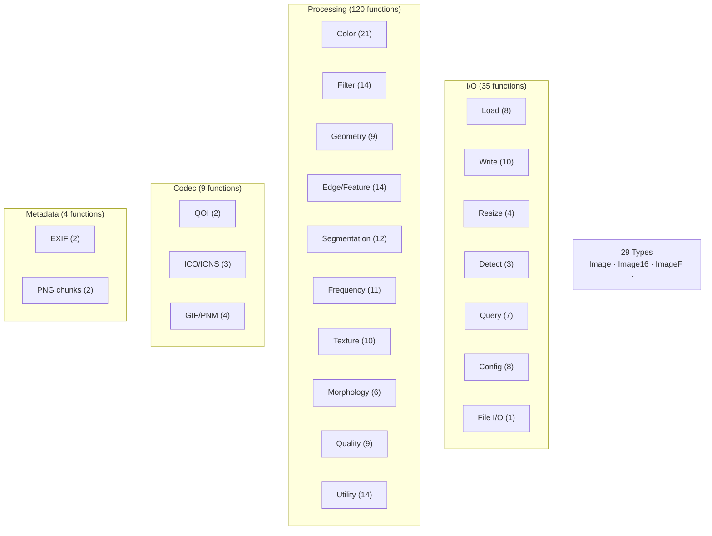

# stb-image

[English](README.md) | [中文](README.zh.md)

[](https://opensource.org/licenses/MIT)
[](https://www.moonbitlang.com/)
[]()
[]()
[]()

MoonBit native FFI bindings for [stb_image.h](https://github.com/nothings/stb) v2.30 + [stb_image_write.h](https://github.com/nothings/stb) v1.16 + [stb_image_resize2.h](https://github.com/nothings/stb) v2.07.

Full image decode/encode/resize/process capability: 8-bit/16-bit/float load, animated GIF, info query, write PNG/BMP/TGA/JPEG/HDR, resize, format detection, QOI/ICO/ICNS/GIF/PNM codec, EXIF/PNG metadata, image processing (crop/rotate/flip/color/filter/histogram/quantize/morphology/edge detect/quality metrics), roundtrip tests, performance benchmarks.

## Features

- **10+ formats decode**: PNG, JPEG, BMP, GIF, PSD, TGA, HDR, PIC, WebP, PNM (PPM/PGM), QOI
- **8 formats encode**: PNG, BMP, TGA, JPEG, HDR, QOI, GIF, PNM (PPM/PGM)
- **3 pixel types**: 8-bit (`Image`), 16-bit (`Image16`), HDR float (`ImageF`)
- **Resize**: 7 filters × 4 edge modes, 8-bit/16-bit/float/sRGB
- **Format detection**: `detect_format` / `decode_any` / `is_supported_format`
- **Image processing**: crop, rotate, flip, color convert, draw/compositing
- **Color adjustment**: brightness, contrast, gamma, invert, HSV/HSL conversion
- **Filters**: box blur, gaussian blur, sharpen, Sobel/Laplacian/Prewitt edge detect
- **Geometry**: affine warp, arbitrary angle rotate
- **Histogram**: compute, equalize, normalize
- **Quantize**: Floyd-Steinberg dithering, median cut
- **Morphology**: erode, dilate, open, close (3x3 structuring element)
- **Quality metrics**: MSE, PSNR, SSIM
- **Advanced processing**: CLAHE, K-means quantize, FFT frequency domain, frequency domain filtering (low/high/band pass)
- **Adaptive thresholding**: mean, Gaussian-weighted, Otsu
- **Connected components**: labeling with 4/8 connectivity, area/bbox/centroid
- **Integral image**: O(1) rectangle sum/mean/variance query
- **Hough transform**: line detection with NMS
- **LBP**: local binary patterns (basic + uniform)
- **Image pyramids**: Gaussian/Laplacian pyramid build/up/down
- **Bilateral filter**: edge-preserving denoising
- **Contour extraction**: Moore boundary tracking, perimeter, area
- **Color segmentation**: K-means, region growing, flood fill
- **NLM denoise**: non-local means (full + fast)
- **Retinex**: SSR, MSR, MSRCR (multi-scale with color restoration)
- **Canny edge**: Gaussian → Sobel → NMS → hysteresis
- **Watershed**: immersion-based segmentation with auto seeds
- **GLCM texture**: contrast, correlation, energy, homogeneity, entropy (4 directions)
- **Haar wavelet**: 1D/2D transform, multi-level decomposition, denoise
- **Harris corners**: structure tensor + NMS + distance filtering
- **Dehaze**: dark channel prior + guided filter
- **Distance transform**: L1/L2/Linf, skeletonize
- **Gabor filter**: multi-orientation multi-scale texture analysis
- **Blend modes**: 13 modes (multiply, screen, overlay, darken, lighten, difference, exclusion, color dodge, color burn, hard light, soft light, linear dodge, linear burn)
- **Metadata**: EXIF reading, PNG text chunks
- **Animated GIF**: multi-frame decode/encode with per-frame delays
- **Info query**: dimensions without decoding pixels
- **Configurable**: flip, unpremultiply alpha, iPhone PNG, HDR gamma/scale
- **Failure diagnostics**: `failure_reason()` exposes stb_image internal error string
- **533 tests + 29 benchmarks**, all passing under AddressSanitizer

## Architecture



### Feature Categories



### Data Flow



### API Classification



## Installation

```bash
moon add toadium/stb-image
```

## Quick Start

```moonbit
// Decode from file
let img : Image = load_from_path("photo.png")
println("width=\{img.width}, height=\{img.height}, channels=\{img.channels}")

// Decode from memory with forced RGBA
let img2 : Image = load_from_bytes(png_bytes, req_channels=Some(4))

// Encode to PNG bytes
let out : Bytes = write_png_to_bytes(img)

// Resize with default filter
let resized : Image = resize(img, 128, 128)

// Auto-detect format and decode
let any : Image = decode_any(data, req_channels=Some(3))

// Load animated GIF
let anim : GifAnimation = load_gif_from_path("animation.gif")
println("frames=\{anim.frames.length()}, delays=\{anim.delays}")

// Read EXIF metadata
let exif : ExifInfo? = read_exif_from_path("photo.jpg")

// Query image info without decoding
let info : ImageInfo? = info_from_path("large.hdr")
```

## Types

| Type | Fields | Description |
|------|--------|-------------|
| `Image` | `width, height, channels : Int; data : Bytes` | 8-bit decoded image |
| `Image16` | `width, height, channels : Int; data : Bytes` | 16-bit decoded image (UInt16 LE, 2 bytes/pixel) |
| `ImageF` | `width, height, channels : Int; data : Bytes` | HDR float decoded image (IEEE 754 LE, 4 bytes/pixel) |
| `ImageInfo` | `width, height, channels : Int` | Image info without pixel data |
| `GifAnimation` | `frames : Array[Image]; delays : Array[Int]` | Animated GIF (delays in milliseconds) |
| `LoadError` | `FileIO(String) \| UnsupportedFormat(String) \| DecodeFailed(String)` | Load failure error |
| `ImageFormat` | `Png \| Jpeg \| Bmp \| Gif \| Tga \| Psd \| Hdr \| Pnm \| Qoi \| Unknown` | Image format enum |
| `ResizeFilter` | `Default \| Box \| Triangle \| CubicBSPline \| CatmullROM \| Mitchell \| PointSample` | Resize filter enum |
| `ResizeEdge` | `Clamp \| Reflect \| Wrap \| Zero` | Resize edge mode enum |
| `ExifInfo` | `make, model, date_time : String; orientation : Int` | EXIF metadata |
| `PngTextChunk` | `keyword, text : String` | PNG tEXt/iTXt chunk |

All types derive `Eq` and `@debug.Debug`.

## API Reference

### Load (8 functions)

All load functions accept optional `req_channels : Int?` (1=gray, 2=gray+alpha, 3=RGB, 4=RGBA). Pass `None` for original channels.

| Function | Signature | Returns |
|----------|-----------|---------|
| `load_from_path` | `(String, req_channels?: Int?) -> Image` | 8-bit from file |
| `load_from_bytes` | `(Bytes, req_channels?: Int?) -> Image` | 8-bit from memory |
| `load_16_from_path` | `(String, req_channels?: Int?) -> Image16` | 16-bit from file |
| `load_16_from_bytes` | `(Bytes, req_channels?: Int?) -> Image16` | 16-bit from memory |
| `loadf_from_path` | `(String, req_channels?: Int?) -> ImageF` | HDR float from file |
| `loadf_from_bytes` | `(Bytes, req_channels?: Int?) -> ImageF` | HDR float from memory |
| `load_gif_from_path` | `(String, req_channels?: Int?) -> GifAnimation` | Animated GIF from file |
| `load_gif_from_bytes` | `(Bytes, req_channels?: Int?) -> GifAnimation` | Animated GIF from memory |

### Write (10 functions)

| Function | Signature | Description |
|----------|-----------|-------------|
| `write_png_to_path` | `(String, Image) -> Unit` | Write PNG to file |
| `write_bmp_to_path` | `(String, Image) -> Unit` | Write BMP to file |
| `write_tga_to_path` | `(String, Image) -> Unit` | Write TGA to file |
| `write_jpeg_to_path` | `(String, Image, quality?: Int) -> Unit` | Write JPEG (quality default 90) |
| `write_hdr_to_path` | `(String, ImageF) -> Unit` | Write HDR to file |
| `write_png_to_bytes` | `(Image) -> Bytes` | Encode PNG to bytes |
| `write_bmp_to_bytes` | `(Image) -> Bytes` | Encode BMP to bytes |
| `write_tga_to_bytes` | `(Image) -> Bytes` | Encode TGA to bytes |
| `write_jpeg_to_bytes` | `(Image, quality?: Int) -> Bytes` | Encode JPEG to bytes |
| `write_hdr_to_bytes` | `(ImageF) -> Bytes` | Encode HDR to bytes |

### Resize (4 functions)

| Function | Signature | Description |
|----------|-----------|-------------|
| `resize` | `(Image, Int, Int, filter?: ResizeFilter, edge?: ResizeEdge) -> Image` | 8-bit resize |
| `resize_srgb` | `(Image, Int, Int, filter?, edge?) -> Image` | sRGB colorspace resize |
| `resize_16` | `(Image16, Int, Int, filter?, edge?) -> Image16` | 16-bit resize |
| `resizef` | `(ImageF, Int, Int, filter?, edge?) -> ImageF` | Float resize |

### Format Detection (3 functions)

| Function | Signature | Description |
|----------|-----------|-------------|
| `detect_format` | `(Bytes) -> ImageFormat` | Detect format from magic bytes |
| `decode_any` | `(Bytes, req_channels?: Int?) -> Image` | Auto-detect and decode |
| `is_supported_format` | `(Bytes) -> Bool` | Check if format is supported |

### QOI Codec (2 functions)

| Function | Signature | Description |
|----------|-----------|-------------|
| `decode_qoi` | `(Bytes) -> Image` | Decode QOI format |
| `encode_qoi` | `(Image) -> Bytes` | Encode QOI format |

### ICO/ICNS Encode (3 functions)

| Function | Signature | Description |
|----------|-----------|-------------|
| `encode_ico` | `(Image) -> Bytes` | Encode single ICO (PNG payload) |
| `encode_ico_sizes` | `(Array[Image]) -> Bytes` | Encode multi-size ICO |
| `encode_icns` | `(Image) -> Bytes` | Encode ICNS (PNG payload) |

### GIF/PNM Encode (4 functions)

| Function | Signature | Description |
|----------|-----------|-------------|
| `encode_gif` | `(Image) -> Bytes` | Encode single-frame GIF89a |
| `encode_gif_animation` | `(GifAnimation) -> Bytes` | Encode multi-frame GIF89a |
| `encode_ppm` | `(Image) -> Bytes` | Encode PPM (P6) |
| `encode_pgm` | `(Image) -> Bytes` | Encode PGM (P5) |

### Transform (7 functions)

| Function | Signature | Description |
|----------|-----------|-------------|
| `crop` | `(Image, Int, Int, Int, Int) -> Image` | Crop region |
| `crop_16` | `(Image16, Int, Int, Int, Int) -> Image16` | Crop 16-bit |
| `cropf` | `(ImageF, Int, Int, Int, Int) -> ImageF` | Crop float |
| `rotate_90` | `(Image) -> Image` | Rotate 90° clockwise |
| `rotate_180` | `(Image) -> Image` | Rotate 180° |
| `rotate_270` | `(Image) -> Image` | Rotate 270° clockwise |
| `flip_horizontal` | `(Image) -> Image` | Flip horizontally |

### Color Conversion (5 functions)

| Function | Signature | Description |
|----------|-----------|-------------|
| `to_grayscale` | `(Image) -> Image` | Convert to grayscale |
| `to_rgb` | `(Image) -> Image` | Remove alpha channel |
| `to_rgba` | `(Image) -> Image` | Add alpha channel |
| `premultiply_alpha` | `(Image) -> Image` | Premultiply alpha |
| `unpremultiply_alpha` | `(Image) -> Image` | Unpremultiply alpha |

### Color Adjustment (8 functions)

| Function | Signature | Description |
|----------|-----------|-------------|
| `adjust_brightness` | `(Image, Int) -> Image` | Adjust brightness by delta |
| `adjust_contrast` | `(Image, Float) -> Image` | Adjust contrast by factor |
| `adjust_gamma` | `(Image, Float) -> Image` | Apply gamma correction |
| `invert` | `(Image) -> Image` | Invert colors |
| `rgb_to_hsv` | `(Int, Int, Int) -> (Float, Float, Float)` | RGB to HSV |
| `hsv_to_rgb` | `(Float, Float, Float) -> (Int, Int, Int)` | HSV to RGB |
| `rgb_to_hsl` | `(Int, Int, Int) -> (Float, Float, Float)` | RGB to HSL |
| `hsl_to_rgb` | `(Float, Float, Float) -> (Int, Int, Int)` | HSL to RGB |

### Filters (6 functions)

| Function | Signature | Description |
|----------|-----------|-------------|
| `box_blur` | `(Image, Int) -> Image` | Box blur (sliding window) |
| `gaussian_blur` | `(Image, Int, Float) -> Image` | Gaussian blur (separable kernel) |
| `sharpen` | `(Image, Float) -> Image` | Sharpen (Laplacian) |
| `edge_detect_sobel` | `(Image) -> Image` | Sobel edge detection |
| `edge_detect_laplacian` | `(Image) -> Image` | Laplacian edge detection |
| `edge_detect_prewitt` | `(Image) -> Image` | Prewitt edge detection |

### Geometry (2 functions)

| Function | Signature | Description |
|----------|-----------|-------------|
| `warp_affine` | `(Image, (Float,Float,Float,Float,Float,Float), Int, Int) -> Image` | Affine warp (bilinear) |
| `rotate` | `(Image, Float) -> Image` | Rotate by arbitrary angle |

### Histogram (3 functions)

| Function | Signature | Description |
|----------|-----------|-------------|
| `histogram` | `(Image) -> Array[Int]` | Compute histogram (256 bins) |
| `histogram_equalize` | `(Image) -> Image` | Histogram equalization |
| `histogram_normalize` | `(Image) -> Image` | Histogram normalization |

### Quantize (2 functions)

| Function | Signature | Description |
|----------|-----------|-------------|
| `floyd_steinberg` | `(Image, Int) -> Image` | Floyd-Steinberg dithering |
| `median_cut` | `(Image, Int) -> Image` | Median cut quantization |

### Morphology (4 functions)

| Function | Signature | Description |
|----------|-----------|-------------|
| `erode` | `(Image) -> Image` | Erosion (3x3 min filter) |
| `dilate` | `(Image) -> Image` | Dilation (3x3 max filter) |
| `morph_open` | `(Image) -> Image` | Opening (erode then dilate) |
| `morph_close` | `(Image) -> Image` | Closing (dilate then erode) |

### Quality Metrics (3 functions)

| Function | Signature | Description |
|----------|-----------|-------------|
| `mse` | `(Image, Image) -> Double` | Mean squared error |
| `psnr` | `(Image, Image) -> Double` | Peak signal-to-noise ratio (dB) |
| `ssim` | `(Image, Image) -> Double` | Structural similarity index [-1, 1] |

### Draw (2 functions)

| Function | Signature | Description |
|----------|-----------|-------------|
| `draw_copy` | `(Image, Image, Int, Int) -> Image` | Copy src onto dst at (x,y) |
| `draw_over` | `(Image, Image, Int, Int) -> Image` | Alpha blend src over dst |

### Metadata (4 functions)

| Function | Signature | Description |
|----------|-----------|-------------|
| `read_exif_from_bytes` | `(Bytes) -> ExifInfo?` | Read EXIF from JPEG bytes |
| `read_exif_from_path` | `(String) -> ExifInfo?` | Read EXIF from JPEG file |
| `read_png_text_chunks` | `(Bytes) -> Array[PngTextChunk]` | Read PNG tEXt/iTXt chunks |
| `read_png_text_chunks_from_path` | `(String) -> Array[PngTextChunk]` | Read PNG text chunks from file |

### Query (7 functions)

| Function | Signature | Description |
|----------|-----------|-------------|
| `info_from_path` | `(String) -> ImageInfo?` | Query info from file (no decode) |
| `info_from_bytes` | `(Bytes) -> ImageInfo?` | Query info from memory |
| `is_16_bit_from_path` | `(String) -> Bool` | Check if 16-bit |
| `is_16_bit_from_bytes` | `(Bytes) -> Bool` | Check if 16-bit |
| `is_hdr_from_path` | `(String) -> Bool` | Check if HDR |
| `is_hdr_from_bytes` | `(Bytes) -> Bool` | Check if HDR |
| `failure_reason` | `() -> String` | Get last stb_image failure reason |

### Config (8 functions)

| Function | Signature | Description |
|----------|-----------|-------------|
| `set_flip_vertically_on_load` | `(Bool) -> Unit` | Flip vertically on load |
| `flip_vertically_on_write` | `(Bool) -> Unit` | Flip vertically on write |
| `set_unpremultiply_on_load` | `(Bool) -> Unit` | Unpremultiply alpha on load |
| `convert_iphone_png_to_rgb` | `(Bool) -> Unit` | Convert iPhone PNG to RGB |
| `hdr_to_ldr_gamma` | `(Float) -> Unit` | HDR to LDR gamma (default 1.0) |
| `hdr_to_ldr_scale` | `(Float) -> Unit` | HDR to LDR scale (default 1.0) |
| `ldr_to_hdr_gamma` | `(Float) -> Unit` | LDR to HDR gamma (default 1.0) |
| `ldr_to_hdr_scale` | `(Float) -> Unit` | LDR to HDR scale (default 1.0) |

### File I/O (1 function)

| Function | Signature | Description |
|----------|-----------|-------------|
| `read_file_bytes` | `(String) -> Bytes` | Read raw file bytes |

### Blend Modes (13 functions)

| Function | Signature | Description |
|----------|-----------|-------------|
| `blend_multiply` | `(Image, Image) -> Image` | Multiply blend |
| `blend_screen` | `(Image, Image) -> Image` | Screen blend |
| `blend_overlay` | `(Image, Image) -> Image` | Overlay blend |
| `blend_darken` | `(Image, Image) -> Image` | Darken blend |
| `blend_lighten` | `(Image, Image) -> Image` | Lighten blend |
| `blend_difference` | `(Image, Image) -> Image` | Difference blend |
| `blend_exclusion` | `(Image, Image) -> Image` | Exclusion blend |
| `blend_color_dodge` | `(Image, Image) -> Image` | Color dodge blend |
| `blend_color_burn` | `(Image, Image) -> Image` | Color burn blend |
| `blend_hard_light` | `(Image, Image) -> Image` | Hard light blend |
| `blend_soft_light` | `(Image, Image) -> Image` | Soft light blend |
| `blend_linear_dodge` | `(Image, Image) -> Image` | Linear dodge blend |
| `blend_linear_burn` | `(Image, Image) -> Image` | Linear burn blend |

### Advanced Processing (5 functions)

| Function | Signature | Description |
|----------|-----------|-------------|
| `clahe` | `(Image, Int, Float) -> Image` | CLAHE (tile size, clip limit) |
| `k_means_quantize` | `(Image, Int, Int) -> Image` | K-means color quantize (k, max_iters) |
| `convolve` | `(Image, Array[Float], Float, Float) -> Image` | Generic convolution (kernel, divisor, offset) |
| `pixelate` | `(Image, Int) -> Image` | Pixelate effect (block size) |
| `replace_color` | `(Image, Array[Byte], Array[Byte], Int) -> Image` | Replace color with tolerance |

### FFT / Frequency Domain (6 functions + 2 types)

| Function | Signature | Description |
|----------|-----------|-------------|
| `fft_2d` | `(Image) -> Array[FFTResult]` | 2D FFT (per channel) |
| `ifft_2d` | `(FFTResult) -> Image` | Inverse 2D FFT |
| `fft_magnitude` | `(FFTResult, Bool) -> Image` | FFT magnitude spectrum |
| `fft_shift` | `(FFTResult) -> FFTResult` | Center FFT (shift zero freq) |
| `freq_filter` | `(Image, FreqFilterType, Float, band_width?: Float) -> Image` | Ideal freq filter |
| `freq_filter_gaussian` | `(Image, FreqFilterType, Float, band_width?: Float) -> Image` | Gaussian freq filter |

Types: `Complex` (re, im : Float), `FFTResult` (width, height : Int; data : Array[Complex]), `FreqFilterType` (LowPass | HighPass | BandPass | BandStop)

### Adaptive Threshold (3 functions)

| Function | Signature | Description |
|----------|-----------|-------------|
| `adaptive_threshold_mean` | `(Image, Int, Int) -> Image` | Mean adaptive threshold (block size, C) |
| `adaptive_threshold_gaussian` | `(Image, Int, Int) -> Image` | Gaussian adaptive threshold |
| `threshold_otsu` | `(Image) -> Image` | Otsu automatic threshold |

### Connected Components (1 function + 2 types)

| Function | Signature | Description |
|----------|-----------|-------------|
| `connected_components` | `(Image, Int) -> (ConnectedComponentLabelImage, Array[ConnectedComponent])` | Label components (connectivity 4/8) |

Types: `ConnectedComponent` (label, area, x, y, w, h, centroid_x, centroid_y), `ConnectedComponentLabelImage` (width, height, labels : Array[Int])

### Integral Image (6 functions + 2 types)

| Function | Signature | Description |
|----------|-----------|-------------|
| `integral_image` | `(Image) -> IntegralImage` | Compute integral image |
| `integral_image_sq` | `(Image) -> IntegralImageSq` | Compute squared integral image |
| `integral_sum` | `(IntegralImage, Int, Int, Int, Int) -> Int64` | Rectangle sum O(1) |
| `integral_sum_sq` | `(IntegralImageSq, Int, Int, Int, Int) -> Int64` | Rectangle squared sum O(1) |
| `integral_mean` | `(IntegralImage, Int, Int, Int, Int) -> Float` | Rectangle mean O(1) |
| `integral_variance` | `(IntegralImage, IntegralImageSq, Int, Int, Int, Int) -> Float` | Rectangle variance O(1) |

Types: `IntegralImage` (width, height, data : Array[Int64]), `IntegralImageSq` (width, height, data : Array[Int64])

### Hough Transform (2 functions + 1 type)

| Function | Signature | Description |
|----------|-----------|-------------|
| `hough_lines` | `(Image, Int, theta_resolution?: Float, rho_resolution?: Float) -> Array[HoughLine]` | Detect lines |
| `hough_lines_nms` | `(Array[HoughLine], rho_threshold?: Float, theta_threshold?: Float) -> Array[HoughLine]` | NMS on Hough lines |

Type: `HoughLine` (rho, theta : Float; votes : Int)

### LBP (2 functions)

| Function | Signature | Description |
|----------|-----------|-------------|
| `lbp` | `(Image) -> Image` | Local binary pattern |
| `lbp_uniform` | `(Image) -> Image` | Uniform LBP (58 patterns) |

### Image Pyramids (4 functions)

| Function | Signature | Description |
|----------|-----------|-------------|
| `pyr_down` | `(Image) -> Image` | Downsample 2x (Gaussian) |
| `pyr_up` | `(Image) -> Image` | Upsample 2x (bilinear) |
| `build_gaussian_pyramid` | `(Image, Int) -> Array[Image]` | Build Gaussian pyramid (levels) |
| `build_laplacian_pyramid` | `(Image, Int) -> Array[Image]` | Build Laplacian pyramid (levels) |

### Bilateral Filter (2 functions)

| Function | Signature | Description |
|----------|-----------|-------------|
| `bilateral_filter` | `(Image, Int, Float, Float) -> Image` | Bilateral filter (radius, sigma_space, sigma_color) |
| `bilateral_filter_fast` | `(Image, Int, Float, Float, Int) -> Image` | Fast bilateral (downsampled) |

### Contour (4 functions + 2 types)

| Function | Signature | Description |
|----------|-----------|-------------|
| `find_contours` | `(Image) -> Array[Contour]` | Moore boundary tracking |
| `draw_contours` | `(Image, Array[Contour], Array[Byte]) -> Image` | Draw contours with color |
| `contour_perimeter` | `(Contour) -> Float` | Contour perimeter |
| `contour_area` | `(Contour) -> Float` | Contour area (shoelace) |

Types: `ContourPoint` (x, y : Int), `Contour` (points : Array[ContourPoint]; is_hole : Bool)

### Segmentation (4 functions + 2 types)

| Function | Signature | Description |
|----------|-----------|-------------|
| `kmeans_segment` | `(Image, Int, max_iters?: Int) -> (SegmentLabelImage, Array[SegmentRegion])` | K-means segmentation |
| `region_growing_segment` | `(Image, Array[(Int, Int)], threshold?: Int) -> (SegmentLabelImage, Array[SegmentRegion])` | Region growing from seeds |
| `flood_fill` | `(Image, Int, Int, Array[Byte], threshold?: Int) -> Image` | Flood fill from (x, y) |
| `segment_to_color` | `(SegmentLabelImage) -> Image` | Visualize label image |

Types: `SegmentLabelImage` (width, height, labels : Array[Int]), `SegmentRegion` (label, area, centroid_x, centroid_y, mean_color)

### NLM Denoise (2 functions)

| Function | Signature | Description |
|----------|-----------|-------------|
| `nlm_denoise` | `(Image, patch_size?: Int, search_size?: Int, h?: Int) -> Image` | Non-local means denoise |
| `nlm_denoise_fast` | `(Image, patch_size?: Int, search_size?: Int, h?: Int, step?: Int) -> Image` | Fast NLM (downsampled search) |

### Retinex (3 functions)

| Function | Signature | Description |
|----------|-----------|-------------|
| `ssr` | `(Image, sigma?: Float, gain?: Float, offset?: Float) -> Image` | Single-scale Retinex |
| `msr` | `(Image, sigmas?: Array[Float], gain?: Float, offset?: Float) -> Image` | Multi-scale Retinex |
| `msrcr` | `(Image, sigmas?: Array[Float], gain?: Float, offset?: Float, alpha?: Float, beta?: Float) -> Image` | Multi-scale Retinex with color restoration |

### Canny Edge (1 function)

| Function | Signature | Description |
|----------|-----------|-------------|
| `canny_edge` | `(Image, low_threshold?: Int, high_threshold?: Int) -> Image` | Canny edge detection |

### Watershed (2 functions)

| Function | Signature | Description |
|----------|-----------|-------------|
| `watershed` | `(Image, Array[Int]) -> Array[Int]` | Watershed from markers |
| `watershed_auto` | `(Image) -> (Array[Int], Int)` | Auto watershed (find local minima) |

### GLCM Texture (3 functions + 1 type)

| Function | Signature | Description |
|----------|-----------|-------------|
| `compute_glcm` | `(Image, Int, Int, levels?: Int) -> Array[Array[Int]]` | Compute GLCM (dx, dy) |
| `glcm_features` | `(Array[Array[Int]]) -> GlcmFeatures` | GLCM features from matrix |
| `glcm_features_multi_direction` | `(Image, levels?: Int) -> Array[GlcmFeatures]` | GLCM features (4 directions) |

Type: `GlcmFeatures` (contrast, correlation, energy, homogeneity, entropy, asm, dissimilarity : Float)

### Haar Wavelet (5 functions + 1 type)

| Function | Signature | Description |
|----------|-----------|-------------|
| `haar_transform_1d` | `(Array[Float]) -> Array[Float]` | 1D Haar transform |
| `haar_inverse_transform_1d` | `(Array[Float]) -> Array[Float]` | 1D Haar inverse |
| `haar_transform_2d` | `(Image, levels?: Int) -> HaarWaveletResult` | 2D Haar transform |
| `haar_inverse_transform_2d` | `(HaarWaveletResult) -> Image` | 2D Haar inverse |
| `haar_denoise` | `(Image, threshold?: Float, soft?: Bool, levels?: Int) -> Image` | Haar wavelet denoise |

Type: `HaarWaveletResult` (width, height, channels : Int; ll : Array[Float]; lh, hl, hh : Array[Array[Float]]; levels : Int)

### Harris Corners (2 functions + 1 type)

| Function | Signature | Description |
|----------|-----------|-------------|
| `harris_corners` | `(Image, k?: Float, threshold?: Float, min_distance?: Int) -> Array[CornerPoint]` | Harris corner detection |
| `draw_corners` | `(Image, Array[CornerPoint], color?: Array[Byte], radius?: Int) -> Image` | Draw corner markers |

Type: `CornerPoint` (x, y : Int; response : Float)

### Dehaze (2 functions)

| Function | Signature | Description |
|----------|-----------|-------------|
| `dehaze` | `(Image, patch_size?: Int, omega?: Float, t0?: Float) -> Image` | Dark channel prior dehaze |
| `guided_filter` | `(Image, Array[Float], radius?: Int, eps?: Float) -> Array[Float]` | Guided filter |

### Distance Transform (3 functions)

| Function | Signature | Description |
|----------|-----------|-------------|
| `distance_transform` | `(Image, distance_type?: Int) -> Array[Float]` | Distance transform (1=L1, 2=L2, 3=Linf) |
| `distance_transform_visualize` | `(Array[Float], Int, Int) -> Image` | Visualize distance field |
| `skeletonize` | `(Image) -> Image` | Skeleton via distance transform |

### Gabor Filter (3 functions)

| Function | Signature | Description |
|----------|-----------|-------------|
| `gabor_filter` | `(Image, Int, Float, Float, lambda?: Float, gamma?: Float, phi?: Float) -> Image` | Gabor filter (size, theta, sigma, ...) |
| `gabor_filter_bank` | `(Image, Int, Float, num_orientations?: Int, lambda?: Float, gamma?: Float) -> Image` | Gabor filter bank |
| `gabor_kernel` | `(Int, Float, Float, lambda?: Float, gamma?: Float, phi?: Float) -> Array[Array[Float]]` | Get Gabor kernel |

### Utility (14 functions + 1 type)

| Function | Signature | Description |
|----------|-----------|-------------|
| `pad` | `(Image, Int, Int, Array[Byte]) -> Image` | Pad with border color |
| `add_border` | `(Image, Int, Int, Int, Int, Array[Byte]) -> Image` | Add asymmetric border |
| `resize_to_cover` | `(Image, Int, Int) -> Image` | Resize to cover (crop excess) |
| `resize_to_contain` | `(Image, Int, Int, Array[Byte]) -> Image` | Resize to contain (pad rest) |
| `threshold` | `(Image, Int) -> Image` | Binary threshold |
| `posterize` | `(Image, Int) -> Image` | Posterize (reduce levels) |
| `extract_channel` | `(Image, Int) -> Image` | Extract single channel |
| `swap_channels` | `(Image, Int, Int) -> Image` | Swap two channels |
| `set_alpha` | `(Image, Byte) -> Image` | Set uniform alpha |
| `fill_alpha` | `(Image, Int, Byte, Byte, Byte) -> Image` | Fill alpha with color |
| `apply_lut` | `(Image, Array[Byte]) -> Image` | Apply 256-entry LUT |
| `gradient_map` | `(Image, Array[(Int, Byte, Byte, Byte)]) -> Image` | Apply gradient color map |
| `compute_stats` | `(Image) -> ImageStats` | Compute image statistics |
| `mean_value` | `(Image) -> Float` | Mean pixel value |

Type: `ImageStats` (min, max, mean, std_dev : Float; histogram : Array[Int])

### Image Compose (5 functions)

| Function | Signature | Description |
|----------|-----------|-------------|
| `hstack` | `(Image, Image) -> Image` | Horizontal stack |
| `vstack` | `(Image, Image) -> Image` | Vertical stack |
| `tile` | `(Image, Int, Int) -> Image` | Tile (cols, rows) |
| `flip_vertical` | `(Image) -> Image` | Flip vertically |
| `transpose` | `(Image) -> Image` | Transpose (swap x/y) |

### Noise (2 functions)

| Function | Signature | Description |
|----------|-----------|-------------|
| `add_noise_gaussian` | `(Image, Float, UInt) -> Image` | Add Gaussian noise (sigma, seed) |
| `add_noise_salt_pepper` | `(Image, Float, UInt) -> Image` | Add salt-and-pepper noise (amount, seed) |

## Error Handling

```moonbit
try {
  let img = load_from_bytes(data)
  // use img
} catch {
  LoadError::FileIO(msg) => println("file IO error: \{msg}")
  LoadError::DecodeFailed(msg) => println("decode failed: \{msg}")
  LoadError::UnsupportedFormat(msg) => println("unsupported format: \{msg}")
}
```

`UnsupportedFormat` and `DecodeFailed` are not precisely distinguishable; stb_image returning NULL defaults to `DecodeFailed`. Use `failure_reason()` for the internal stb_image error string.


## Target Support

**Native only.** Multi-target (wasm/js) evaluated and deferred:
- Requires Emscripten build chain + `extern "wasm"` / `extern "js"` FFI
- Type definitions (`Image`, `Image16`, `ImageF`, `ImageInfo`, `GifAnimation`, `LoadError`) are target-agnostic

## Limitations

- **I/O callbacks** (`stbi_io_callbacks`): not implemented. MoonBit FFI does not support passing closures as C function pointers (no closure invocation API in `moonbit.h`).
- **Zero-copy**: not implemented. All load paths copy pixel data from C buffer to MoonBit `Bytes` via `memcpy`. Zero-copy would require GC boundary analysis.
- **Multi-target**: deferred (see above).

## Build & Test

```bash
# Check compilation
moon check --target native

# Run tests
moon test --target native

# Run benchmarks
moon bench --target native

# Run ASan validation (requires VS Developer environment)
python scripts/run-asan.py --repo-root . --pkg src/moon.pkg --no-disable-mimalloc

# Regenerate API interface
moon info  # outputs src/pkg.generated.mbti
```

## Project Structure

```
stb-image/
├── moon.mod                  # Module config (v1.17.0, preferred_target = native)
├── ROADMAP.md                # Iteration roadmap
├── COMPARISON.md             # mooncakes.io image library comparison
├── SKILL.md                  # Package usage guide
├── src/
│   ├── moon.pkg              # Root package: re-export + bench + roundtrip
│   ├── reexport.mbt          # Backward-compat API (128 pub fn + 12 types)
│   ├── bench.mbt             # 29 performance benchmarks
│   ├── roundtrip_test.mbt    # Full format roundtrip tests
│   ├── core/                 # Core: types + FFI + load/write/resize + detect + ICO
│   │   ├── moon.pkg          # native-stub: wrapper.c
│   │   ├── image_types.mbt   # Image, Image16, ImageF, ImageInfo, GifAnimation, LoadError
│   │   ├── ffi.mbt           # Private extern "c" declarations
│   │   ├── wrapper.c         # C FFI wrapper (ABI normalization)
│   │   ├── stb_image*.h      # Vendored upstream headers
│   │   ├── image_*_native.mbt# load/write/resize/info/gif/16/float
│   │   ├── image_detect.mbt  # detect_format/decode_any/is_supported_format
│   │   ├── icon_encode.mbt   # encode_ico/encode_ico_sizes/encode_icns
│   │   └── *_test.mbt        # Core tests
│   ├── process/              # Image processing (pure MoonBit)
│   │   ├── moon.pkg          # imports @core
│   │   ├── transform.mbt     # crop/rotate_*/flip_horizontal
│   │   ├── color_convert.mbt # to_grayscale/to_rgb/to_rgba/premultiply
│   │   ├── color_adjust.mbt  # adjust_*/invert/rgb_to_hsv/hsv_to_rgb/...
│   │   ├── filter.mbt        # box_blur/gaussian_blur/sharpen/edge_detect_sobel
│   │   ├── geometry.mbt      # warp_affine/rotate
│   │   ├── histogram.mbt     # histogram/equalize/normalize
│   │   ├── quantize.mbt      # floyd_steinberg/median_cut
│   │   ├── draw.mbt          # draw_copy/draw_over
│   │   ├── morphology.mbt    # erode/dilate/morph_open/morph_close
│   │   ├── edge_detect.mbt   # edge_detect_laplacian/edge_detect_prewitt
│   │   ├── image_quality.mbt # mse/psnr/ssim
│   │   └── *_test.mbt        # Process tests
│   ├── format/               # Format codecs (pure MoonBit)
│   │   ├── moon.pkg          # imports @core
│   │   ├── qoi.mbt           # decode_qoi/encode_qoi
│   │   ├── gif_encode.mbt    # encode_gif/encode_gif_animation
│   │   ├── pnm_encode.mbt    # encode_ppm/encode_pgm/encode_pnm
│   │   └── *_test.mbt        # Format tests
│   ├── meta/                 # Metadata (pure MoonBit)
│   │   ├── moon.pkg          # imports @core
│   │   ├── exif.mbt          # read_exif_from_bytes/read_exif_from_path
│   │   ├── png_meta.mbt      # read_png_text_chunks/...
│   │   └── *_test.mbt        # Metadata tests
│   └── util/                 # Utility functions (pure MoonBit)
│       ├── moon.pkg          # imports @core, @process
│       ├── image_util.mbt    # pad/border/resize_to_cover/contain/pixelate/...
│       ├── pixel_ops.mbt     # threshold/posterize/extract_channel/swap_channels
│       ├── pixel_advanced.mbt# set_alpha/fill_alpha/replace_color/apply_lut
│       ├── image_stats.mbt   # compute_stats/mean_value
│       ├── image_compose.mbt # hstack/vstack/tile/flip_vertical/transpose
│       ├── image_noise.mbt   # add_noise_gaussian/add_noise_salt_pepper
│       ├── color_map.mbt     # gradient_map/blend_*
│       └── *_test.mbt        # Utility tests
├── scripts/
│   ├── prepare.py            # Vendoring script
│   ├── gen_testdata.py       # Test image generator
│   ├── run-asan.py           # ASan validation
│   └── gen_reexport.py       # Re-export file generator
└── testdata/                 # Test images (PNG/BMP/GIF/JPG + corrupt)
```

## Version History

| Version | Highlights | Tests |
|---------|-----------|-------|
| v0.1 | 8-bit load (path + bytes), 9 formats | 23 |
| v0.2 | write (PNG/BMP/TGA/JPEG) + req_channels + flip | 32 |
| v0.3 | 16-bit/float load + info + failure_reason + config | 55 |
| v0.4 | HDR config + animated GIF | 61 |
| v1.0 | API freeze, complete docs, ASan verified | 61 |
| v1.1 | HDR write + resize (FFI stb_image_resize2.h) | 75 |
| v1.2 | QOI/ICO/ICNS/GIF encode + format auto-detect | 114 |
| v1.3 | crop/rotate/flip + color convert + draw/compositing | 145 |
| v1.4 | color adjust + filters + geometry + histogram + quantize | 206 |
| v1.5 | PNM encode + GIF animation + EXIF reading | 229 |
| **v1.6** | **PNG metadata + roundtrip tests + benchmarks** | **254+29** |
| **v1.7** | **pad/border/resize_to_cover/contain + threshold/posterize/extract_channel + blend modes** | **275+29** |
| **v1.8** | **more blend modes + stats + pixelate/replace_color/convolve/swap_channels** | **292+29** |
| **v1.9** | **hstack/vstack/tile/transpose + noise + LUT/gradient_map + alpha ops** | **315+29** |
| **v1.10** | **morphology (erode/dilate/open/close) + Laplacian/Prewitt edge + MSE/PSNR/SSIM** | **341+29** |
| **v1.12** | **6 blend modes + CLAHE + K-means quantize + FFT frequency domain** | **369+29** |
| **v1.13** | **frequency filtering + adaptive threshold + connected components + integral image** | **402+29** |
| **v1.14** | **Hough transform + LBP + image pyramids + bilateral filter** | **433+29** |
| **v1.15** | **contour extraction + color segmentation + NLM denoise + Retinex** | **472+29** |
| **v1.16** | **Canny edge + watershed + GLCM texture + Haar wavelet** | **501+29** |
| **v1.17** | **Harris corners + dehaze + distance transform + Gabor filter** | **533+29** |

## Upstream

- [stb_image.h](https://github.com/nothings/stb/blob/master/stb_image.h) — commit `013ac3beddff3dbffafd5177e7972067cd2b5083` (v2.30)
- [stb_image_write.h](https://github.com/nothings/stb/blob/master/stb_image_write.h) — same commit (v1.16)
- [stb_image_resize2.h](https://github.com/nothings/stb/blob/master/stb_image_resize2.h) — v2.07

## License

MIT License — see [LICENSE](LICENSE).

stb_image.h, stb_image_write.h, and stb_image_resize2.h are public domain (Sean Barrett).
