# image 架构文档

> 版本 v2.0.0 | 196 公开函数 + 27 类型 | 645 测试 × 3 目标 (native/wasm-gc/js)

## 概述

image 是 纯 MoonBit 图像处理库，封装 [stb](https://github.com/nothings/stb) 系列单头文件库，提供完整的图像解码/编码/缩放/处理能力。采用多子包架构（types, core, lib, pure, process, format, meta, util），根包 re-export 保持向后兼容 API。

## 功能分类

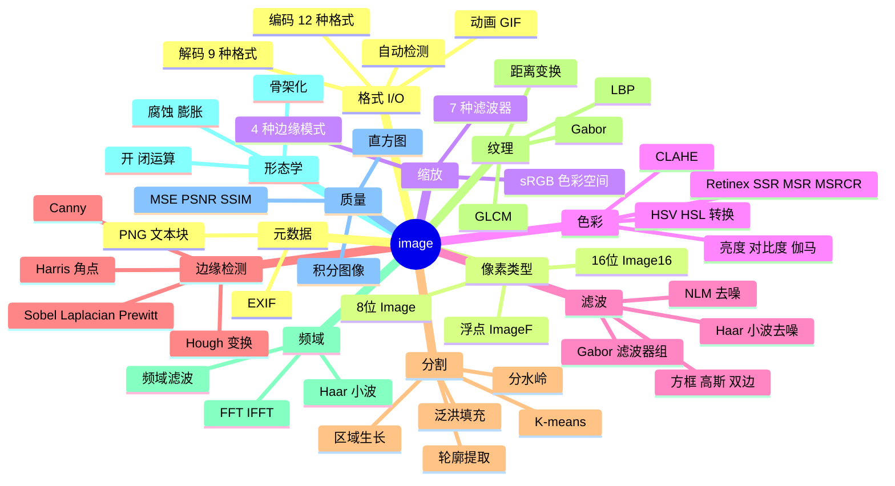

## 包结构概览

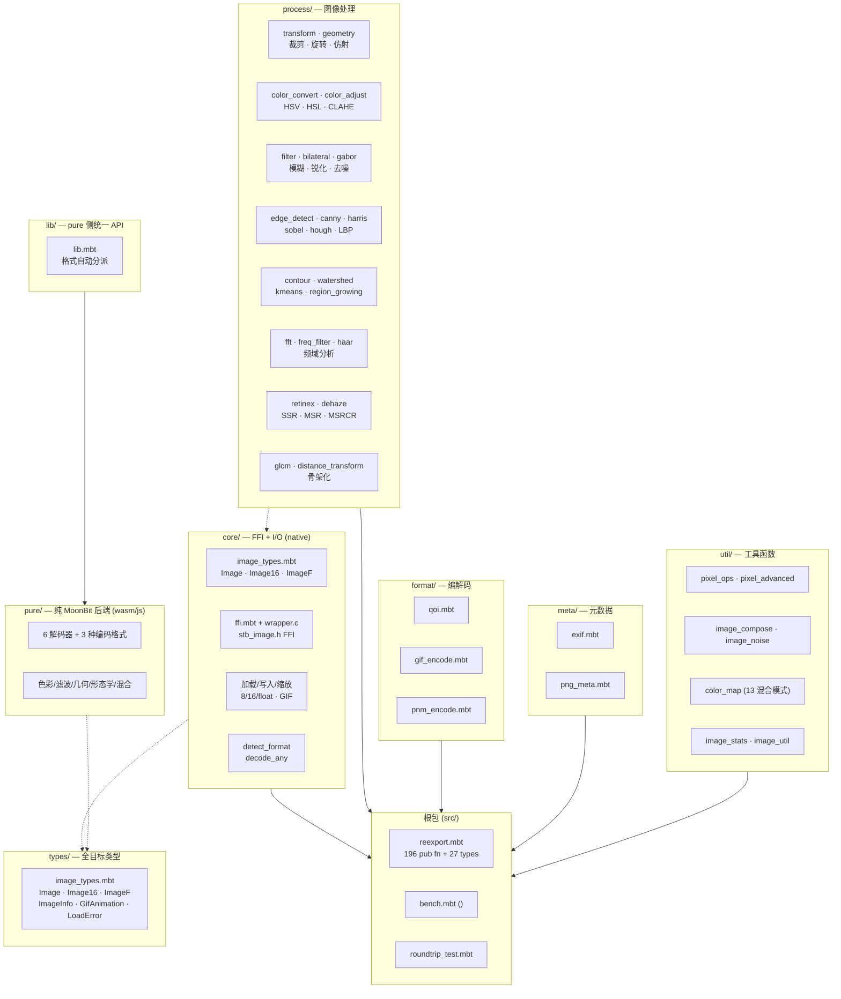

## 包依赖关系

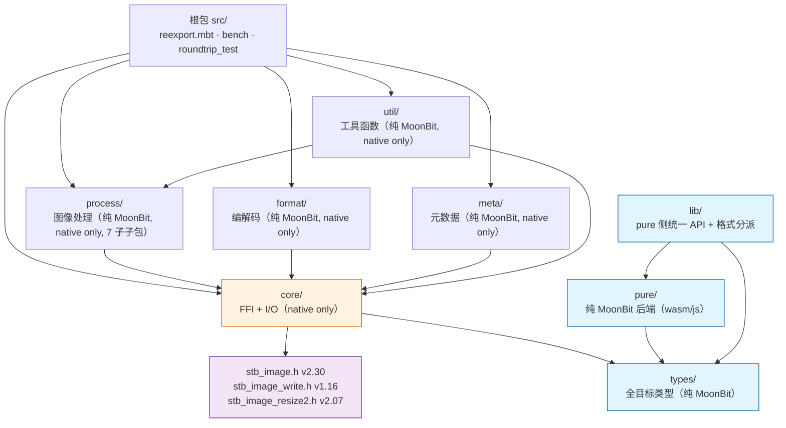

## FFI 边界

```mermaid
flowchart LR
    subgraph MoonBit["MoonBit 层"]
        Types["image_types.mbt<br/>Image · Image16 · ImageF"]
        FFI["ffi.mbt<br/>extern \"c\" 声明"]
        Native["image_*_native.mbt<br/>加载/写入/缩放"]
    end

    subgraph C["C 层"]
        Wrapper["wrapper.c<br/>ABI 标准化"]
        Stb["stb_image*.h<br/>单头文件库"]
    end

    Types --> Native
    Native --> FFI
    FFI --> Wrapper
    Wrapper --> Stb

    subgraph Memory["内存管理"]
        Alloc["stbi_malloc<br/>C 分配"]
        Copy["memcpy<br/>C → MoonBit Bytes"]
        Free["stbi_image_free<br/>C 释放"]
    end

    Stb --> Alloc
    Alloc --> Copy
    Copy --> Free
```

**FFI 约束**：
- 所有像素数据通过 `memcpy` 从 C 缓冲区复制到 MoonBit `Bytes`（无零拷贝）
- `wrapper.c` 负责 ABI 标准化：将 stb 的 `unsigned char*` 返回值转换为 MoonBit 可读的 `Bytes`
- 闭包无法作为 C 函数指针传递（`stbi_io_callbacks` 未实现）

## 子包详解

### core/ — FFI + 类型 + I/O

```mermaid
flowchart TB
    subgraph CorePkg["core/ (FFI 边界)"]
        direction TB
        Types["image_types_reexport.mbt<br/>从 @types re-export 类型别名"]
        FFI["ffi.mbt<br/>私有 extern \"c\" 声明"]
        Wrapper["wrapper.c<br/>C ABI 包装器"]
        Load["image_load_native.mbt<br/>load_from_path/bytes<br/>load_16_* · loadf_* · load_gif_*"]
        Write["image_write_native.mbt<br/>write_png/bmp/tga/jpeg/hdr<br/>set_flip_vertically_on_load"]
        Resize["image_resize_native.mbt<br/>resize · resize_16 · resizef · resize_srgb"]
        Info["image_info_native.mbt<br/>info_from_path/bytes<br/>is_16_bit · is_hdr<br/>set_unpremultiply · hdr_to_ldr_gamma/scale"]
        Detect["image_detect.mbt<br/>detect_format · decode_any<br/>is_supported_format"]
        Icon["icon_encode.mbt<br/>encode_ico · encode_icns"]
        Gif["image_gif_native.mbt<br/>GIF 加载"]
        Float["image_float_native.mbt<br/>HDR 浮点加载"]
        Int16["image_16_native.mbt<br/>16位加载"]
        FileIO["file_io_native.mbt<br/>read_file_bytes"]
    end
```

**职责**：所有 C FFI 交互、像素类型定义、加载/写入/缩放/检测/配置

**关键设计**：
- `Image.data : Bytes` — 像素数据存储在 MoonBit 管理的 `Bytes` 中，C 侧分配后立即拷贝并释放
- `LoadError` — 三种错误变体：`FileIO` / `UnsupportedFormat` / `DecodeFailed`
- `req_channels` — 可选参数强制输出通道数（1=灰度, 2=灰度+Alpha, 3=RGB, 4=RGBA）

### process/ — 图像处理

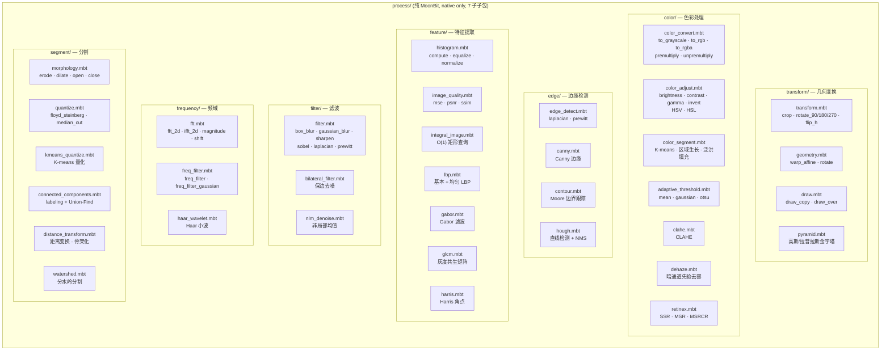

**职责**：所有纯 MoonBit 图像处理算法，无直接 FFI 依赖（但因依赖 @core 类型而仅支持 native 目标）

**关键设计**：
- 仅依赖 `@core`（类型定义）和 `@math`（数学函数）
- 所有函数接受 `Image` 返回 `Image`，支持函数组合
- 27 个类型中 15 个定义在此包（`Complex`, `FFTResult`, `FreqFilterType`, `ConnectedComponent`, ...）

### format/ — 编解码

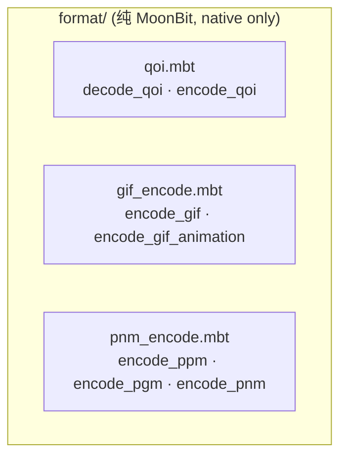

**职责**：QOI/GIF/PNM 格式的纯 MoonBit 编解码

### meta/ — 元数据

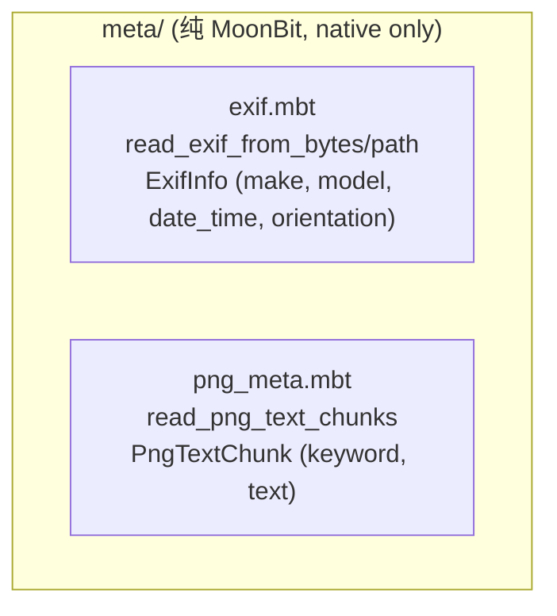

**职责**：EXIF 和 PNG 文本块元数据读取

### util/ — 工具函数

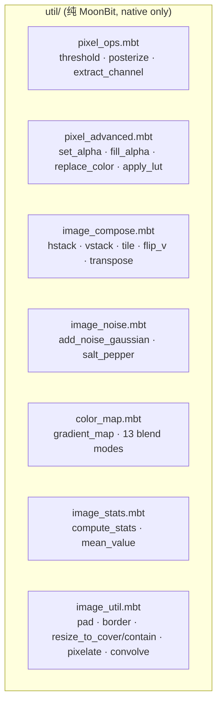

**职责**：像素操作、图像合成、噪声、色彩映射、统计等工具函数

## 数据流

### 处理流水线概览

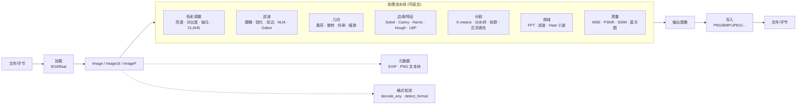

### 加载-处理-写入序列图

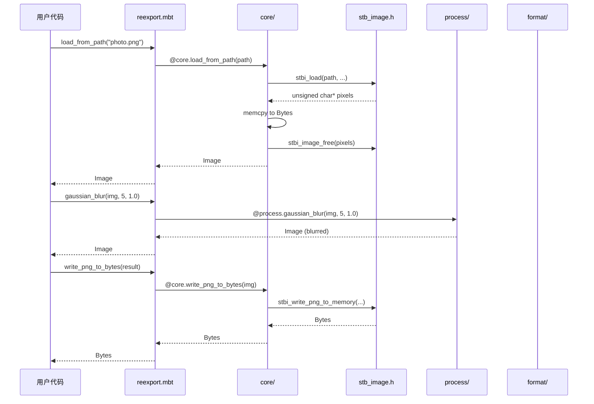

### 格式检测流程

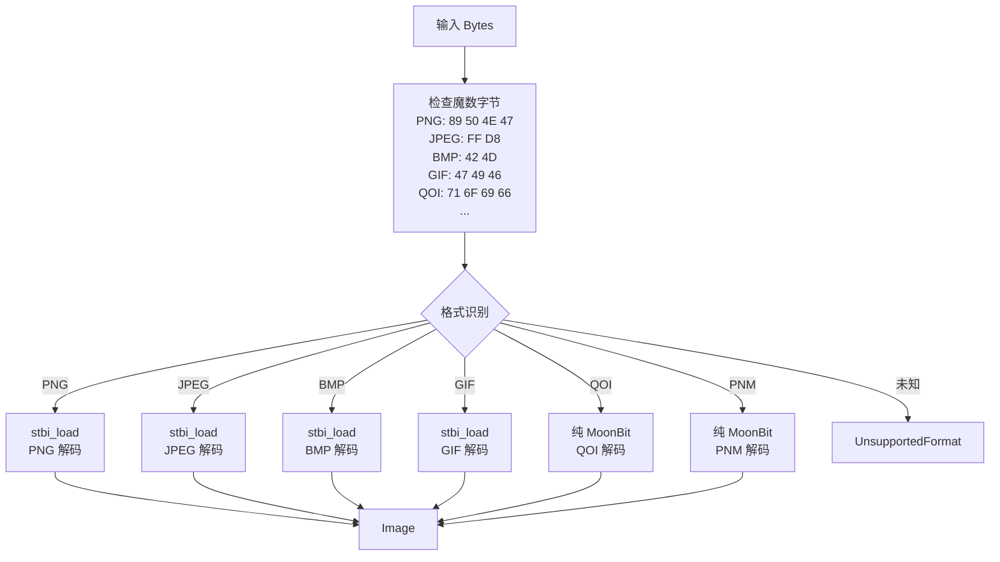

## API 分类

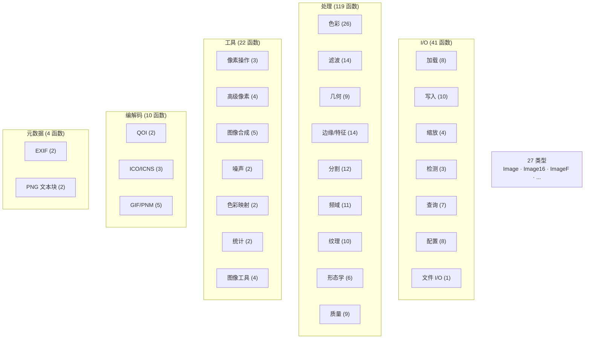

## 类型体系

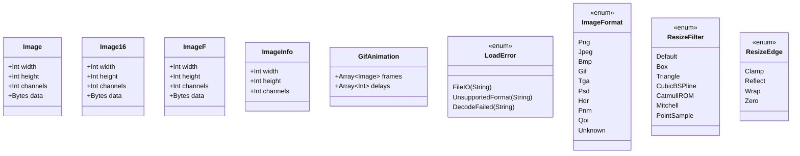

> 上述仅展示 9 个核心类型。完整 27 个类型列表（含 `ExifInfo`、`PngTextChunk`、`ImageStats`、`Complex`、`FFTResult`、`ConnectedComponent`、`HoughLine`、`Contour`、`GlcmFeatures`、`HaarWaveletResult`、`CornerPoint` 等 18 个处理/元数据/工具类型）详见 [api_reference.md](api_reference.md)。

## 项目结构

```
image/
├── moon.mod                  # 模块配置 (v2.0.0, preferred_target = native)
├── README.md                 # 项目说明（中文）
├── docs/
│   ├── architecture.md       # 架构文档（本文）
│   ├── api_reference.md      # 完整 API 参考
│   ├── changelog.md          # 版本历史
│   ├── roadmap.md            # 迭代路线图
│   ├── comparison.md         # mooncakes.io 图像库对比
│   └── skill.md              # 包使用指南
├── src/
│   ├── moon.pkg              # 根包：re-export + 基准测试 + 往返测试
│   ├── reexport.mbt          # 向后兼容API（196 pub fn + 27 类型）
│   ├── bench.mbt             # 75个性能基准测试
│   ├── roundtrip_test.mbt    # 全格式往返测试
│   ├── types/                # 全目标类型包（Image/Image16/ImageF/ImageInfo 等）
│   │   ├── moon.pkg          # 依赖 @debug
│   │   └── image_types.mbt   # 跨目标共享类型定义
│   ├── core/                 # 核心：FFI + 加载/写入/缩放 + 检测 + ICO（native only）
│   │   ├── moon.pkg          # native-stub: wrapper.c
│   │   ├── image_types_reexport.mbt # 从 @types re-export 类型别名
│   │   ├── ffi.mbt           # 私有 extern "c" 声明
│   │   ├── wrapper.c         # C FFI 包装器（ABI标准化）
│   │   ├── stb_image*.h      # 第三方上游头文件
│   │   ├── image_*_native.mbt# load/write/resize/info/gif/16/float/file_io
│   │   ├── image_detect.mbt  # detect_format/decode_any/is_supported_format
│   │   ├── icon_encode.mbt   # encode_ico/encode_ico_sizes/encode_icns
│   │   └── *_test.mbt        # 核心测试
│   ├── process/              # 图像处理（纯MoonBit，7 个子子包）
│   │   ├── moon.pkg          # 空占位包
│   │   ├── transform/        # 裁剪/旋转/翻转/金字塔/绘制
│   │   ├── color/            # 色彩转换/调整/CLAHE/Retinex/去雾/分割/阈值
│   │   ├── filter/           # 模糊/锐化/双边/NLM/Gabor
│   │   ├── edge/             # Sobel/Laplacian/Prewitt/Canny/Hough/轮廓
│   │   ├── frequency/        # FFT/频域滤波/Haar 小波
│   │   ├── feature/          # 直方图/积分图像/GLCM/Harris/LBP/质量评估
│   │   └── segment/          # 形态学/量化/连通域/分水岭/距离变换
│   ├── format/               # 格式编解码（纯MoonBit）
│   │   ├── moon.pkg          # 导入 @core
│   │   ├── qoi.mbt           # decode_qoi/encode_qoi
│   │   ├── gif_encode.mbt    # encode_gif/encode_gif_animation
│   │   ├── pnm_encode.mbt    # encode_ppm/encode_pgm/encode_pnm
│   │   └── *_test.mbt        # 格式测试
│   ├── meta/                 # 元数据（纯MoonBit）
│   │   ├── moon.pkg          # 导入 @core
│   │   ├── exif.mbt          # read_exif_from_bytes/read_exif_from_path
│   │   ├── png_meta.mbt      # read_png_text_chunks/...
│   │   └── *_test.mbt        # 元数据测试
│   ├── util/                 # 工具函数（纯MoonBit）
│   │   ├── moon.pkg          # 导入 @core, @process/transform, @debug, @math
│   │   ├── image_util.mbt    # pad/border/resize_to_cover/contain/pixelate/...
│   │   ├── pixel_ops.mbt     # threshold/posterize/extract_channel/swap_channels
│   │   ├── pixel_advanced.mbt# set_alpha/fill_alpha/replace_color/apply_lut
│   │   ├── image_stats.mbt   # compute_stats/mean_value
│   │   ├── image_compose.mbt # hstack/vstack/tile/flip_vertical/transpose
│   │   ├── image_noise.mbt   # add_noise_gaussian/add_noise_salt_pepper
│   │   ├── color_map.mbt     # gradient_map/blend_*
│   │   └── *_test.mbt        # 工具测试
│   ├── pure/                 # 纯 MoonBit 后端（wasm/js 目标）
│   │   ├── moon.pkg          # 依赖 @types, @math, @encoding/utf8, @debug
│   │   ├── bmp_decode.mbt    # BMP 解码
│   │   ├── qoi_decode.mbt    # QOI 解码
│   │   ├── qoi_encode.mbt    # QOI 编码
│   │   ├── tga_decode.mbt    # TGA 解码
│   │   ├── pnm_decode.mbt    # PNM 解码
│   │   ├── pnm_encode.mbt    # PNM 编码
│   │   ├── psd_decode.mbt    # PSD 解码
│   │   ├── gif_decode.mbt    # GIF 解码
│   │   ├── gif_encode.mbt    # GIF 编码
│   │   ├── color_adjust.mbt  # 色彩调整
│   │   ├── color_convert.mbt # 色彩转换
│   │   ├── filter.mbt        # 滤波/边缘检测
│   │   ├── geometry.mbt      # 几何变换
│   │   ├── transform.mbt     # 旋转/翻转
│   │   ├── histogram.mbt     # 直方图
│   │   ├── morphology.mbt    # 形态学
│   │   ├── pixel_ops.mbt     # 像素操作
│   │   ├── pixel_advanced.mbt# 高级像素操作
│   │   ├── image_compose.mbt # 图像合成
│   │   ├── image_noise.mbt   # 噪声
│   │   ├── image_stats.mbt   # 统计
│   │   ├── image_util.mbt    # 工具
│   │   ├── color_map.mbt     # 色彩映射
│   │   ├── blend.mbt         # 13 种混合模式
│   │   └── *_test.mbt        # pure 后端测试
│   └── lib/                  # pure 侧统一 API + 自动格式分派
│       ├── moon.pkg          # 依赖 @types, @pure, @debug
│       ├── lib.mbt           # 统一入口 + 格式自动分派
│       └── lib_test.mbt      # lib 测试
├── scripts/
│   ├── prepare.py            # 第三方代码准备脚本
│   ├── gen_testdata.py       # 测试图像生成器
│   ├── run-asan.py           # ASan验证
│   └── gen_reexport.py       # Re-export文件生成器
└── testdata/                 # 测试图像（PNG/BMP/GIF/JPG + 损坏文件）
```

## 设计决策

### 1. 多子包架构（v2.0）

**问题**：单包超过 30 个源文件，编译慢、职责不清

**方案**：按职责拆分为 `core`（FFI）/ `process`（处理）/ `format`（编解码）/ `meta`（元数据）/ `util`（工具），根包 re-export 保持 API 兼容。v2.0 升级为八子包：新增 `types`（全目标类型）、`pure`（纯 MoonBit 后端）、`lib`（pure 侧统一 API）

**收益**：编译并行化、职责清晰、可独立测试、多目标支持

### 2. re-export 策略

**问题**：`pub let` 无法 re-export 带标签参数的函数

**方案**：普通函数用 `pub let` 直接别名，带标签参数的函数用 `pub fn` 包装器保留默认值

### 3. FFI 内存管理

**问题**：MoonBit GC 与 C malloc 的内存边界

**方案**：C 侧分配 → `memcpy` 到 MoonBit `Bytes` → 立即 `stbi_image_free`。无零拷贝，但安全简单

### 4. 纯 MoonBit vs FFI

**原则**：
- stb 已有的功能 → FFI 绑定（低成本、高质量、ASan 可验证）
- stb 没有的功能 → 纯 MoonBit 实现（放在 `process/` 或 `format/`）
- 格式编解码：QOI/GIF/PNM 用纯 MoonBit，PNG/JPEG/BMP/TGA/HDR 用 FFI

### 5. `pub(all) struct` vs `pub struct`

**问题**：测试中需要构造 struct 实例

**方案**：需要外部构造的类型用 `pub(all) struct`（如 `HoughLine`, `Contour`, `CornerPoint`），仅内部使用的用 `pub struct`

## 性能特征

| 操作 | 复杂度 | 备注 |
|------|--------|------|
| 加载/写入 | O(n) | n = 像素数，FFI 调用 |
| 缩放 | O(n) | FFI stb_image_resize2 |
| box_blur | O(n) | 滑动窗口优化 |
| gaussian_blur | O(n × r) | 可分离核，r = 半径 |
| bilateral_filter | O(n × r²) | r = 半径 |
| bilateral_filter_fast | O(n × r² / s²) | s = 降采样因子 |
| nlm_denoise | O(n × s² × p²) | s = 搜索窗口, p = 块大小 |
| fft_2d | O(n log n) | Cooley-Tukey radix-2 |
| connected_components | O(n × α(n)) | Union-Find，α ≈ 4 |
| integral_image | O(n) | 预处理 |
| integral_sum/mean/variance | O(1) | 矩形查询 |
| distance_transform | O(n) | 两遍扫描 |
| hough_lines | O(n × θ) | θ = 角度分辨率 |
| watershed | O(n log n) | 优先队列 |
| dehaze | O(n × p²) | p = 暗通道块大小 |
