# image 架构文档

> 版本 v4.8.0 | 283 公开函数 + 47 类型 | 1126 测试 × 4 目标 (native/wasm-gc/js/wasm)

## 概述

image 是 纯 MoonBit 图像处理库，无 C FFI 依赖，提供完整的图像解码/编码/缩放/处理能力。采用多子包架构（types, pure, lib, process, meta, util），根包 re-export 保持向后兼容 API。四目标 (native/wasm-gc/js/wasm) 均使用纯 MoonBit 实现，各 1126 测试通过。

## 功能分类

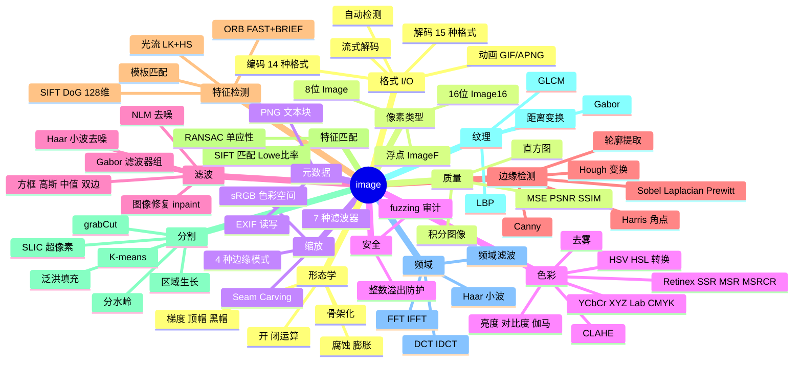

## 包结构概览

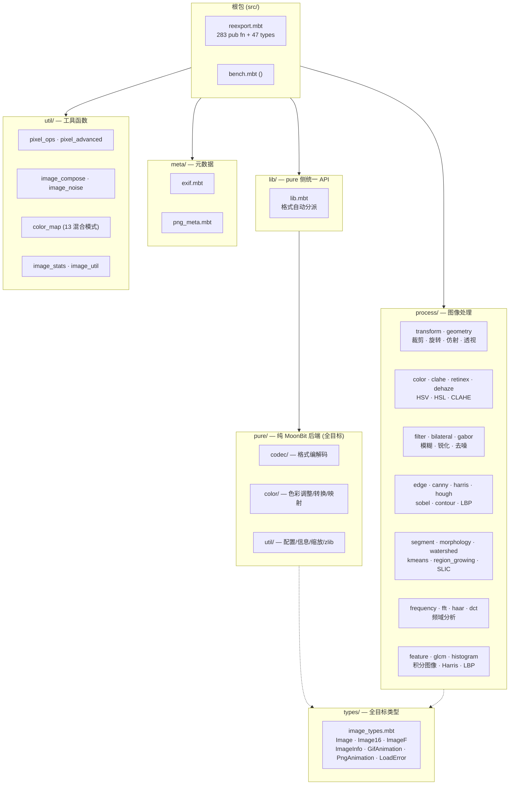

## 包依赖关系

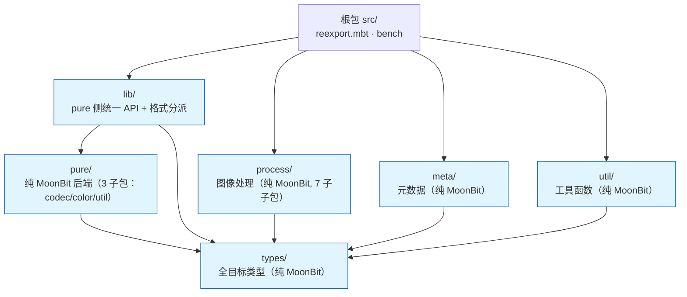

## 纯 MoonBit 架构

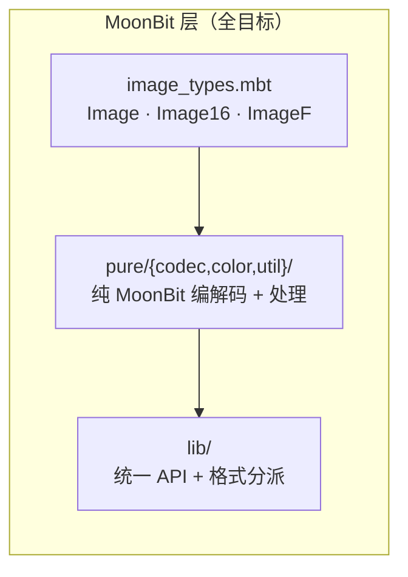

**架构约束**：
- 所有代码纯 MoonBit 实现，无 C FFI 依赖
- 四目标 (native/wasm-gc/js/wasm) 共用同一套代码
- 像素数据存储在 MoonBit 管理的 `Bytes` 中，无跨语言内存边界

## 子包详解

### lib/ — pure 侧统一 API + 格式分派

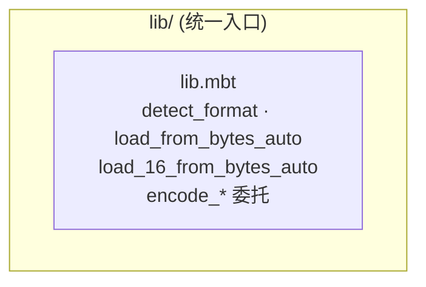

**职责**：格式自动分派、编解码委托，委托 @pure/codec 实现纯 MoonBit 后端

**关键设计**：
- `Image.data : Bytes` — 像素数据存储在 MoonBit 管理的 `Bytes` 中
- `LoadError` — 四种错误变体：`FileIO` / `UnsupportedFormat` / `DecodeFailed` / `EncodeFailed`
- `req_channels` — 可选参数强制输出通道数（1=灰度, 2=灰度+Alpha, 3=RGB, 4=RGBA）

### pure/ — 纯 MoonBit 后端

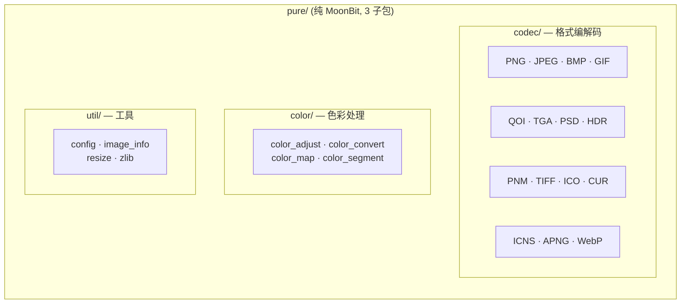

**职责**：所有格式编解码和基础色彩/工具操作的纯 MoonBit 实现

### process/ — 图像处理

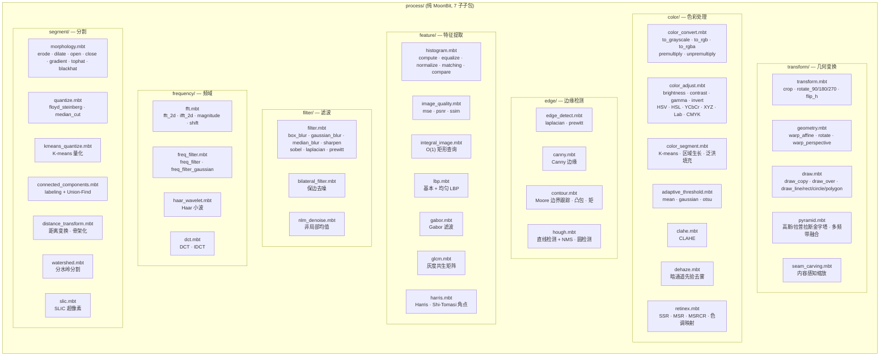

**职责**：所有纯 MoonBit 图像处理算法，无 C FFI 依赖，全目标支持

**关键设计**：
- 仅依赖 `@types`（类型定义）和 `@math`（数学函数）
- 所有函数接受 `Image` 返回 `Image`，支持函数组合
- 36 个类型中多数定义在此包（`Complex`, `FFTResult`, `FreqFilterType`, `ConnectedComponent`, ...）

### meta/ — 元数据

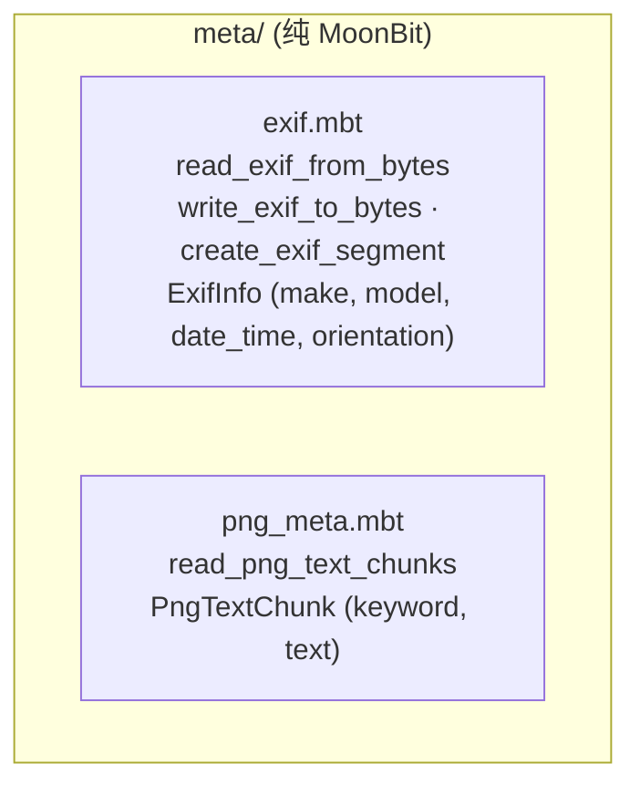

**职责**：EXIF 读写和 PNG 文本块元数据读取

### util/ — 工具函数

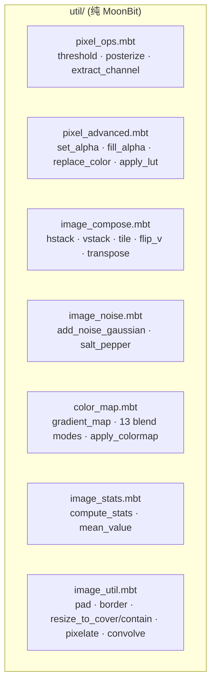

**职责**：像素操作、图像合成、噪声、色彩映射、统计等工具函数

## 数据流

### 处理流水线概览

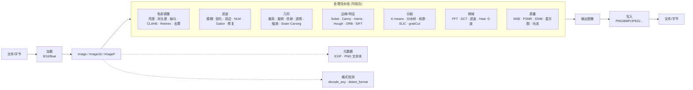

### 加载-处理-写入序列图

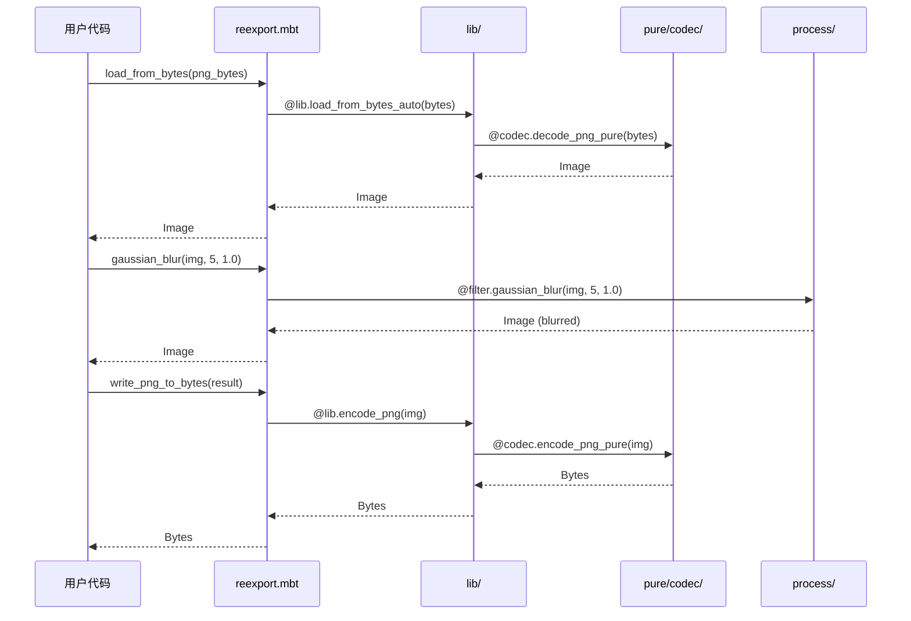

### 格式检测流程

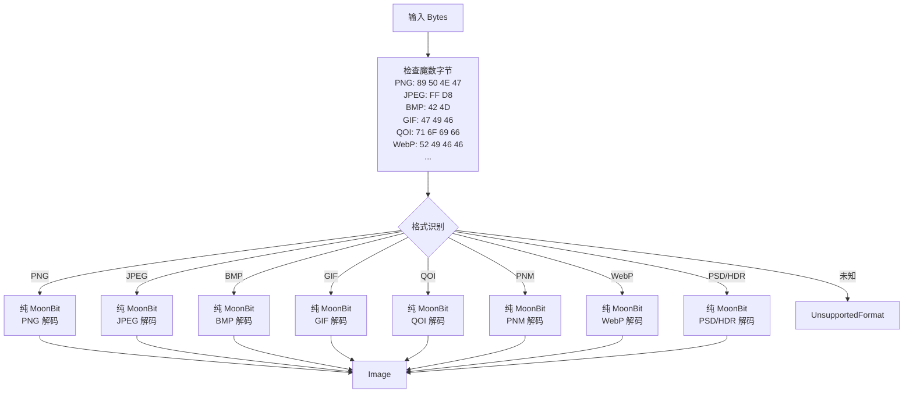

## API 分类

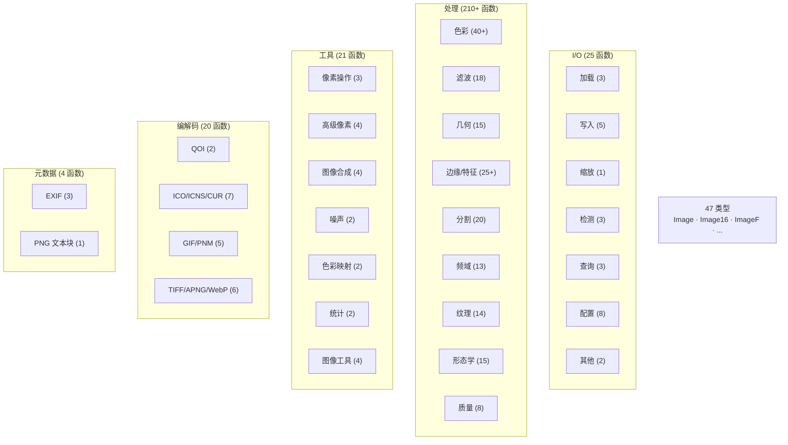

## 类型体系

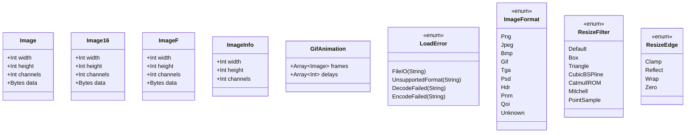

> 上述仅展示 9 个核心类型。完整 47 个类型列表（含 `PngAnimation`、`ExifInfo`、`PngTextChunk`、`ImageStats`、`Complex`、`FFTResult`、`ConnectedComponent`、`HoughLine`、`Contour`、`GlcmFeatures`、`HaarWaveletResult`、`CornerPoint`、`HistCompareMethod`、`StructuringElement`、`PerspectiveMatrix`、`AffineMatrix`、`Moments`、`Circle`、`Colormap`、`SuperpixelResult`、`SiftKeyPoint`、`SiftDescriptor`、`SiftMatch`、`StreamInfo`、`OrbKeyPoint`、`OrbDescriptor`、`DescriptorMatch`、`TemplateMatchMethod`、`TemplateMatchResult`、`FlowResult` 等 38 个处理/元数据/工具类型）详见 [api_reference.md](api_reference.md)。

## 项目结构

```
image/
├── moon.mod                  # 模块配置 (v4.8.0, preferred_target = native)
├── README.md                 # 项目说明（中文）
├── docs/
│   ├── architecture.md       # 架构文档（本文）
│   ├── api_reference.md      # 完整 API 参考
│   ├── changelog.md          # 版本历史
│   ├── roadmap.md            # 迭代路线图
│   ├── comparison.md         # mooncakes.io 图像库对比
│   └── skill.md              # 包使用指南
├── src/
│   ├── moon.pkg              # 根包：re-export + 基准测试
│   ├── reexport.mbt          # 向后兼容API（283 pub fn + 47 类型）
│   ├── reexport_test.mbt     # re-export 测试
│   ├── bench.mbt             # 性能基准测试
│   ├── types/                # 全目标类型包（Image/Image16/ImageF/ImageInfo 等）
│   │   ├── moon.pkg          # 依赖 @debug
│   │   └── image_types.mbt   # 跨目标共享类型定义
│   ├── pure/                 # 纯 MoonBit 后端（全目标，3 子包）
│   │   ├── codec/            # 编解码：BMP/QOI/TGA/PNM/PSD/GIF/PNG/JPEG/HDR/TIFF/ICO/CUR/ICNS/APNG/WebP
│   │   ├── color/            # 色彩：color_adjust, color_convert, color_map
│   │   ├── util/             # 工具：config, image_info, resize, zlib
│   │   └── */*_test.mbt      # pure 后端测试
│   ├── lib/                  # pure 侧统一 API + 自动格式分派
│   │   ├── moon.pkg          # 依赖 @types, @pure, @debug
│   │   ├── lib.mbt           # 统一入口 + 格式自动分派
│   │   └── lib_test.mbt      # lib 测试
│   ├── process/              # 图像处理（纯MoonBit，7 个子子包）
│   │   ├── moon.pkg          # 空占位包
│   │   ├── transform/        # 裁剪/旋转/翻转/金字塔/绘制/透视/seam carving
│   │   ├── color/            # 色彩转换/调整/CLAHE/Retinex/去雾/分割/阈值
│   │   ├── filter/           # 模糊/锐化/双边/NLM/Gabor
│   │   ├── edge/             # Sobel/Laplacian/Prewitt/Canny/Hough/轮廓
│   │   ├── frequency/        # FFT/频域滤波/Haar小波/DCT
│   │   ├── feature/          # 直方图/积分图像/GLCM/Harris/LBP/质量评估
│   │   └── segment/          # 形态学/量化/连通域/分水岭/距离变换/SLIC
│   ├── meta/                 # 元数据（纯MoonBit）
│   │   ├── moon.pkg          # 导入 @types
│   │   ├── exif.mbt          # read_exif_from_bytes/write_exif_to_bytes
│   │   ├── png_meta.mbt      # read_png_text_chunks/...
│   │   └── *_test.mbt        # 元数据测试
│   ├── util/                 # 工具函数（纯MoonBit）
│   │   ├── moon.pkg          # 导入 @types, @process/transform, @debug, @math
│   │   ├── image_util.mbt    # pad/border/resize_to_cover/contain/pixelate/...
│   │   ├── pixel_ops.mbt     # threshold/posterize/extract_channel/swap_channels
│   │   ├── pixel_advanced.mbt# set_alpha/fill_alpha/replace_color/apply_lut
│   │   ├── image_stats.mbt   # compute_stats/mean_value
│   │   ├── image_compose.mbt # hstack/vstack/tile/flip_vertical/transpose
│   │   ├── image_noise.mbt   # add_noise_gaussian/add_noise_salt_pepper
│   │   ├── color_map.mbt     # gradient_map/blend_*/apply_colormap
│   │   └── *_test.mbt        # 工具测试
│   └── testdata/             # 测试图像（PNG/BMP/GIF/JPG + 损坏文件）
```

## 设计决策

### 1. 多子包架构（v2.0）

**问题**：单包超过 30 个源文件，编译慢、职责不清

**方案**：按职责拆分为 `types`（全目标类型）/ `pure`（纯 MoonBit 后端，3 子包：codec/color/util）/ `lib`（pure 侧统一 API）/ `process`（图像处理，7 子包）/ `meta`（元数据）/ `util`（工具函数），根包 re-export 保持 API 兼容。

**收益**：编译并行化、职责清晰、可独立测试、多目标支持

### 2. re-export 策略

**问题**：`pub let` 无法 re-export 带标签参数的函数

**方案**：普通函数用 `pub let` 直接别名，带标签参数的函数用 `pub fn` 包装器保留默认值

### 3. 纯 MoonBit 全目标

**问题**：C FFI 仅支持 native 目标，wasm/js 无法使用

**方案**：v2.0 移除所有 C FFI 依赖，全部用纯 MoonBit 重写。像素数据存储在 MoonBit `Bytes` 中，无跨语言内存边界。四目标 (native/wasm-gc/js/wasm) 共用同一套代码

### 4. pure 子包拆分

**原则**：
- `pure/codec/` — 所有格式编解码（BMP/QOI/TGA/PNM/PSD/GIF/PNG/JPEG/HDR/TIFF/ICO/CUR/ICNS/APNG/WebP）
- `pure/color/` — 色彩调整/转换/映射
- `pure/util/` — 工具（配置/信息/缩放/zlib inflate）

### 5. `pub(all) struct` vs `pub struct`

**问题**：测试中需要构造 struct 实例

**方案**：需要外部构造的类型用 `pub(all) struct`（如 `HoughLine`, `Contour`, `CornerPoint`），仅内部使用的用 `pub struct`

## 性能特征

| 操作 | 复杂度 | 备注 |
|------|--------|------|
| 加载/写入 | O(n) | n = 像素数，纯 MoonBit |
| 缩放 | O(n) | 纯 MoonBit resize |
| box_blur | O(n) | 滑动窗口优化 |
| gaussian_blur | O(n × r) | 可分离核，r = 半径 |
| bilateral_filter | O(n × r²) | r = 半径 |
| bilateral_filter_fast | O(n × r² / s²) | s = 降采样因子 |
| nlm_denoise | O(n × s² × p²) | s = 搜索窗口, p = 块大小 |
| fft_2d | O(n log n) | Cooley-Tukey radix-2 |
| connected_components | O(n × α(n)) | Union-Find，α ≈ 4 |
| integral_image | O(n) | 预处理 |
| integral_sum/mean/variance | O(1) | 矩形查询 |
| distance_transform | O(n) | 两遍扫描 |
| hough_lines | O(n × θ) | θ = 角度分辨率 |
| watershed | O(n log n) | 优先队列 |
| dehaze | O(n × p²) | p = 暗通道块大小 |
