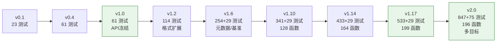

# stb-image 迭代路线图

> 基于 mooncakes.io image 库对比（见 [comparison.md](comparison.md)）制定的后续迭代计划。
> 制定日期：2026-08-06 | 最后更新：2026-08-09 | 当前版本：v2.0.0

## 现状定位

### 版本演进时间线

### 功能增长曲线

**stb-image v1.10.0 的独特优势**：
- PSD/HDR/PNM 独家格式（其他库均不支持）
- 16-bit/float 像素深度（仅 bikallem 有 16-bit）
- ASan 内存安全验证（独家）
- 128 公开函数 + 12 类型，341 测试 + 29 基准测试
- 全格式 roundtrip 验证
- EXIF/PNG 元数据读取（独家）
- 形态学操作 + 图像质量评估（MSE/PSNR/SSIM）（独家）
- **五子包架构**：core（FFI+类型）/ process（图像处理）/ format（编解码）/ meta（元数据）/ util（工具函数），根包 re-export 保持向后兼容

**主要差距**（对比 5 个已有库）：
| 缺失功能 | 已有此功能的库 | 实现路径 |
|---|---|---|
| WebP 编码 | mizchi | 纯 MoonBit (lossless) |
| 流式解码 | mizchi | 纯 MoonBit (架构改动大) |
| TIFF 解码 | — | 纯 MoonBit 或 FFI |
| wasm/js 目标 | mizchi | 需要完全不同的 FFI 方案 |

## 迭代原则

1. **FFI 优先**：stb 库本身支持的功能优先通过 FFI 绑定（低成本、高质量、ASan 可验证）
2. **纯 MoonBit 补齐**：stb 不支持的功能用纯 MoonBit 实现，放在单独包中
3. **不破坏 v1.0 API**：新增功能只添加，不修改已有签名
4. **测试先行**：每个新功能必须有测试 + ASan 验证（FFI 部分）
5. **差异化优先**：优先补齐其他库都有的功能，再考虑独特功能

---

## v1.1 — HDR 写入 + resize（FFI 绑定）✅

**目标**：补齐 HDR 全生命周期 + resize 能力

### 功能

1. **HDR 写入**（FFI，stb_image_write.h 已有 `stbi_write_hdr`）
   - `write_hdr_to_path(path, image_f)` — 写入 HDR 文件
   - `write_hdr_to_bytes(image_f)` — 写入 HDR 字节流

2. **resize**（FFI，vendor `stb_image_resize2.h`）
   - `resize(image, new_w, new_h, filter?, edge?) -> Image` — 8-bit resize
   - `resize_srgb(image, new_w, new_h, filter?, edge?) -> Image` — sRGB colorspace
   - `resize_16(image16, new_w, new_h, filter?, edge?) -> Image16` — 16-bit resize
   - `resizef(imagef, new_w, new_h, filter?, edge?) -> ImageF` — float resize
   - 7 种滤波器 + 4 种边缘模式

### 交付物
- `src/stb_image_resize2.h` — vendored v2.07
- 75 测试，ASan 通过

---

## v1.2 — 纯 MoonBit 格式扩展 ✅

**目标**：补齐其他库普遍有的格式，消除"格式短板"

### 功能

1. **GIF 编码**（纯 MoonBit）— `encode_gif` / `encode_gif_animation`
2. **ICO/ICNS 编码**（纯 MoonBit）— `encode_ico` / `encode_ico_sizes` / `encode_icns`
3. **QOI 解码/编码**（纯 MoonBit）— `decode_qoi` / `encode_qoi`
4. **格式自动检测**（纯 MoonBit）— `detect_format` / `decode_any` / `is_supported_format` + `ImageFormat` 枚举

### 交付物
- 114 测试，ASan 通过

---

## v1.3 — 图像处理操作 ✅

**目标**：补齐图像处理能力

### 功能

1. **crop/rotate/flip** — `crop` / `crop_16` / `cropf` / `rotate_90` / `rotate_180` / `rotate_270` / `flip_horizontal`
2. **色彩模型转换** — `to_grayscale` / `to_rgb` / `to_rgba` / `premultiply_alpha` / `unpremultiply_alpha`
3. **draw/compositing** — `draw_copy` / `draw_over`

### 交付物
- 145 测试，ASan 通过

---

## v1.4 — 图像处理增强 ✅

**目标**：补齐高级图像处理能力

### 功能

1. **色彩调整**（8 函数）— `adjust_brightness` / `adjust_contrast` / `adjust_gamma` / `invert` / `rgb_to_hsv` / `hsv_to_rgb` / `rgb_to_hsl` / `hsl_to_rgb`
2. **滤波/卷积**（4 函数）— `box_blur`（滑动窗口优化）/ `gaussian_blur`（可分离高斯核）/ `sharpen`（拉普拉斯锐化）/ `edge_detect_sobel`（Sobel 算子）
3. **几何变换**（2 函数）— `warp_affine`（仿射变换+双线性插值）/ `rotate`（任意角度旋转）
4. **直方图**（3 函数）— `histogram` / `histogram_equalize` / `histogram_normalize`
5. **量化**（2 函数）— `floyd_steinberg`（误差扩散抖动）/ `median_cut`（中位切分量化）

### 交付物
- 206 测试，ASan 通过

---

## v1.5 — PNM/GIF 动画/EXIF ✅

**目标**：格式扩展 + 元数据读取

### 功能

1. **PNM 编码**（3 函数）— `encode_ppm` / `encode_pgm` / `encode_pnm`
2. **GIF 动画**（1 函数）— `encode_gif_animation`（多帧 GIF89a + Netscape 循环扩展 + Graphic Control Extension）
3. **EXIF 读取**（2 函数 + 1 类型）— `read_exif_from_bytes` / `read_exif_from_path` + `ExifInfo` 结构

### 交付物
- 229 测试，ASan 通过

---

## v1.6 — PNG 元数据 + roundtrip + 性能基准 ✅

**目标**：质量增强 + 元数据扩展

### 功能

1. **PNG text chunks 读取**（2 函数 + 1 类型）— `read_png_text_chunks` / `read_png_text_chunks_from_path` + `PngTextChunk` 结构
2. **全格式 roundtrip 测试**（19 测试）— PNG/BMP/TGA/JPEG/QOI/GIF/PPM/PGM/ICO/HDR + transform/color/resize/filter/quantize pipeline
3. **性能基准测试套件**（29 bench）— 覆盖 load/write/resize/filter/transform/color/histogram/quantize/detect

### 交付物
- 254 测试 + 29 基准测试，ASan 通过
- 88 公开函数 + 11 类型/枚举

---

## v1.7 — API 增强 ✅

**目标**：补齐常用图像处理工具函数

### 功能
1. **图像工具**（4 函数）— `pad` / `add_border` / `resize_to_cover` / `resize_to_contain`
2. **像素操作**（3 函数）— `threshold` / `posterize` / `extract_channel`
3. **混合模式**（3 函数）— `blend_multiply` / `blend_screen` / `blend_overlay`

### 交付物
- 275 测试 + 29 基准测试

---

## v1.8 — 更多 API 增强 ✅

**目标**：继续扩展像素级操作和统计

### 功能
1. **更多混合模式**（4 函数）— `blend_darken` / `blend_lighten` / `blend_difference` / `blend_exclusion`
2. **图像统计**（2 函数 + 1 类型）— `compute_stats` / `mean_value` + `ImageStats`
3. **高级像素操作**（4 函数）— `pixelate` / `replace_color` / `convolve` / `swap_channels`

### 交付物
- 292 测试 + 29 基准测试

---

## v1.9 — 拼接/噪声/色彩映射 ✅

**目标**：图像合成和噪声生成

### 功能
1. **图像拼接**（5 函数）— `hstack` / `vstack` / `tile` / `flip_vertical` / `transpose`
2. **噪声**（2 函数）— `add_noise_gaussian` / `add_noise_salt_pepper`（LCG + Box-Muller）
3. **色彩映射**（4 函数）— `apply_lut` / `gradient_map` / `set_alpha` / `fill_alpha`

### 交付物
- 315 测试 + 29 基准测试

---

## v1.10 — 形态学 + 边缘检测 + 质量评估 ✅

**目标**：补齐形态学操作和图像质量评估

### 功能
1. **形态学操作**（4 函数）— `erode` / `dilate` / `morph_open` / `morph_close`（3x3 结构元素）
2. **边缘检测扩展**（2 函数）— `edge_detect_laplacian` / `edge_detect_prewitt`
3. **图像质量评估**（3 函数）— `mse` / `psnr` / `ssim`

### 交付物
- 341 测试 + 29 基准测试
- 128 公开函数 + 12 类型/枚举

---

## v1.10.1 — 子包重构 + 代码清理 ✅

**目标**：将单包拆分为多子包，提升可维护性

### 功能
1. **五子包架构** — `core/`（FFI+类型+加载/写入/缩放+检测+ICO）+ `process/`（图像处理）+ `format/`（编解码）+ `meta/`（元数据）+ `util/`（工具函数）
2. **reexport.mbt** — 根包 re-export 保持向后兼容 API（`pub let` 用于普通函数，`pub fn` 包装器用于带标签参数的函数）
3. **中文 README** — `README.md`（中文），文档统一存放 `docs/` 目录
4. **警告清理** — 删除未使用的 test_helpers，0 警告 0 错误

### 交付物
- 341 测试 + 29 基准测试，0 警告
- 五子包 + reexport，向后兼容

---

## v1.12 — 高级图像处理算法 ✅

**目标**：添加更多高级图像处理算法

### 功能
1. **混合模式扩展**（6 函数）— `blend_color_dodge` / `blend_color_burn` / `blend_hard_light` / `blend_soft_light` / `blend_linear_dodge` / `blend_linear_burn`
2. **CLAHE**（1 函数）— `clahe`（对比度受限自适应直方图均衡，分块直方图+裁剪+双线性插值）
3. **K-means 量化**（1 函数）— `k_means_quantize`（K-means 聚类色彩量化）
4. **FFT 频域变换**（4 函数 + 2 类型）— `fft_2d` / `ifft_2d` / `fft_magnitude` / `fft_shift` + `Complex` / `FFTResult`（Cooley-Tukey radix-2，自动补零到 2 的幂次方）

### 交付物
- 369 测试 + 29 基准测试
- 140 公开函数 + 14 类型/枚举

---

## v1.13 — 频域滤波 + 自适应阈值 + 连通域 + 积分图像 ✅

**目标**：扩展图像分析能力

### 功能
1. **频域滤波**（2 函数 + 1 类型）— `freq_filter` / `freq_filter_gaussian` + `FreqFilterType`（低通/高通/带通/带阻，理想+高斯传递函数）
2. **自适应阈值**（3 函数）— `adaptive_threshold_mean` / `adaptive_threshold_gaussian` / `threshold_otsu`（均值法、高斯加权法、Otsu 大津法）
3. **连通域标记**（1 函数 + 2 类型）— `connected_components` + `ConnectedComponent` / `ConnectedComponentLabelImage`（两遍扫描 + Union-Find，4/8 连通，含面积/边界框/质心）
4. **积分图像**（6 函数 + 2 类型）— `integral_image` / `integral_image_sq` / `integral_sum` / `integral_sum_sq` / `integral_mean` / `integral_variance` + `IntegralImage` / `IntegralImageSq`（O(1) 矩形区域查询）

### 交付物
- 402 测试 + 29 基准测试
- 152 公开函数 + 21 类型/枚举

---

## v1.14 — 霍夫变换 + LBP + 图像金字塔 + 双边滤波 ✅

**目标**：扩展特征提取和滤波能力

### 功能
1. **霍夫变换**（2 函数 + 1 类型）— `hough_lines` / `hough_lines_nms` + `HoughLine`（直线检测，极坐标累加器，非极大值抑制）
2. **局部二值模式**（2 函数）— `lbp` / `lbp_uniform`（基本 LBP + 均匀 LBP，58 种均匀模式映射）
3. **图像金字塔**（4 函数）— `pyr_down` / `pyr_up` / `build_gaussian_pyramid` / `build_laplacian_pyramid`（高斯金字塔 + 拉普拉斯金字塔，下采样2x2均值 + 上采样双线性插值）
4. **双边滤波**（2 函数）— `bilateral_filter` / `bilateral_filter_fast`（保边去噪，空间+值域高斯加权，快速版降采样近似）

### 交付物
- 433 测试 + 29 基准测试
- 164 公开函数 + 22 类型/枚举

---

## v1.15 — 轮廓提取 + 颜色分割 + NLM 去噪 + Retinex ✅

**目标**：扩展轮廓分析和高级去噪能力

### 功能
1. **轮廓提取与绘制**（4 函数 + 2 类型）— `find_contours` / `draw_contours` / `contour_perimeter` / `contour_area` + `ContourPoint` / `Contour`（Moore 边界跟踪，外轮廓/孔洞标记，鞋带公式面积）
2. **颜色分割**（4 函数 + 2 类型）— `kmeans_segment` / `region_growing_segment` / `flood_fill` / `segment_to_color` + `SegmentLabelImage` / `SegmentRegion`（K-means 聚类分割 + 区域生长 + 泛洪填充 + 标签可视化）
3. **非局部均值去噪**（2 函数）— `nlm_denoise` / `nlm_denoise_fast`（块匹配加权平均，快速版降采样搜索）
4. **多尺度 Retinex**（3 函数）— `ssr` / `msr` / `msrcr`（单尺度/多尺度/带颜色恢复，可分离高斯模糊）

### 交付物
- 472 测试 + 29 基准测试
- 177 公开函数 + 26 类型/枚举

---

## v1.16 — Canny 边缘 + 分水岭 + GLCM + Haar 小波 ✅

**目标**：扩展边缘检测、分割、纹理分析和多分辨率分析能力

### 功能
1. **Canny 边缘检测**（1 函数）— `canny_edge`（高斯模糊→Sobel 梯度→非极大值抑制→双阈值滞后连接）
2. **分水岭分割**（2 函数）— `watershed` / `watershed_auto`（沉浸式分水岭算法，基于种子标记，自动寻找局部最小值）
3. **GLCM 纹理分析**（3 函数 + 1 类型）— `compute_glcm` / `glcm_features` / `glcm_features_multi_direction` + `GlcmFeatures`（灰度共生矩阵，对比度/相关性/能量/同质性/熵/ASM/不相似性，4 方向）
4. **Haar 小波变换**（5 函数 + 1 类型）— `haar_transform_1d` / `haar_inverse_transform_1d` / `haar_transform_2d` / `haar_inverse_transform_2d` / `haar_denoise` + `HaarWaveletResult`（多级分解重构，软/硬阈值去噪）

### 交付物
- 501 测试 + 29 基准测试
- 188 公开函数 + 28 类型/枚举

---

## v1.17 — Harris 角点 + 去雾 + 距离变换 + Gabor 滤波 ✅

**目标**：扩展特征检测、去雾、形态学和纹理分析能力

### 功能
1. **Harris 角点检测**（2 函数 + 1 类型）— `harris_corners` / `draw_corners` + `CornerPoint`（Sobel 梯度→结构张量→Harris 响应→NMS→距离过滤）
2. **暗通道先验去雾**（2 函数）— `dehaze` / `guided_filter`（暗通道先验+大气光估计+透射率恢复+引导滤波优化）
3. **距离变换**（3 函数）— `distance_transform` / `distance_transform_visualize` / `skeletonize`（两遍扫描，L1/L2/Linf 距离，骨架化）
4. **Gabor 滤波**（3 函数）— `gabor_filter` / `gabor_filter_bank` / `gabor_kernel`（多方向多尺度纹理分析）

### 交付物
- 533 测试 + 29 基准测试
- 199 公开函数 + 29 类型/枚举

---

## v2.0 — 多目标支持（架构升级）✅

**目标**：支持 wasm/js 目标，与 mizchi 拉平

### 方案

此版本需要重大架构决策，两个可选路径：

**路径 A：双后端**
- native 目标：保持现有 C FFI 绑定
- wasm/js 目标：纯 MoonBit fallback（移植 stb 核心解码逻辑）
- 优点：native 性能保留
- 缺点：维护两套代码

**路径 B：全纯 MoonBit**
- 移除 C FFI，全部用纯 MoonBit 重写
- 优点：单一代码库，全目标支持
- 缺点：失去 stb 的格式覆盖（PSD/HDR/PNM）、失去 ASan 验证、工作量巨大

**推荐路径 A**，但需要评估维护成本。

### 交付物（已完成）
- `src/core/` — native 后端（现有 C FFI）
- `src/pure/` — 纯 MoonBit 后端：6 解码器（BMP/QOI/TGA/PNM/PSD/GIF）+ 3 编码器（QOI/PNM/GIF）+ 几何变换/色彩转换/色彩调整/滤波/直方图/形态学/仿射变换/像素操作/色彩映射/图像拼接/统计/噪声/13 blend 混合模式
- `src/lib/` — pure 侧统一 API + 自动格式分派（T12），目录含 lib.mbt + lib_test.mbt + moon.pkg 3 文件
- `src/types/` — 全目标类型包（T2）
- 测试：native 847 + wasm 225 + js 225 通过

---

## v2.1 — 高级格式（远期）

**目标**：进一步扩展格式覆盖

### 功能

1. **WebP 编码**（纯 MoonBit，lossless only）
   - `encode_webp(image) -> Bytes`
   - 参考 mizchi/image

2. **流式解码**（纯 MoonBit）
   - `decode_png_stream(bytes, on_row~) -> StreamInfo`
   - `decode_bmp_stream(bytes, on_row~) -> StreamInfo`
   - 参考 mizchi/image

3. **TIFF 解码**（纯 MoonBit 或 FFI）
   - stb 不支持 TIFF，需要独立实现或绑定 libtiff

4. **APNG 解码**（纯 MoonBit）
   - Animated PNG 支持

---

## 版本时间线

| 版本 | 内容 | 测试数 | 优先级 |
|---|---|---|---|
| v1.0 | API freeze, complete docs, ASan verified | 61 | 高 |
| v1.1 | HDR write + resize (FFI) | 75 | 高 |
| v1.2 | QOI/ICO/ICNS/GIF 编码 + auto-detect | 114 | 高 |
| v1.3 | crop/rotate/color/draw | 145 | 中 |
| v1.4 | 色彩调整/滤波/几何/直方图/量化 | 206 | 中 |
| v1.5 | PNM/GIF 动画/EXIF | 229 | 中 |
| **v1.6** | **PNG meta/roundtrip/bench** | **254+29** | **中** |
| **v1.7** | **API 增强: pad/border/resize_to_cover/contain + threshold/posterize/extract_channel + blend** | **275+29** | **中** |
| **v1.8** | **更多 blend + stats + pixelate/replace_color/convolve/swap_channels** | **292+29** | **中** |
| **v1.9** | **hstack/vstack/tile/transpose + noise + LUT/gradient_map + alpha ops** | **315+29** | **中** |
| **v1.10** | **morphology + Laplacian/Prewitt edge + MSE/PSNR/SSIM** | **341+29** | **中** |
| **v1.10.1** | **子包重构 + 双语README + 警告清理** | **341+29** | **中** |
| **v1.12** | **6 blend + CLAHE + K-means + FFT** | **369+29** | **中** |
| **v1.13** | **频域滤波 + 自适应阈值 + 连通域 + 积分图像** | **402+29** | **中** |
| **v1.14** | **霍夫变换 + LBP + 图像金字塔 + 双边滤波** | **433+29** | **中** |
| **v1.15** | **轮廓提取 + 颜色分割 + NLM 去噪 + Retinex** | **472+29** | **中** |
| **v1.16** | **Canny 边缘 + 分水岭 + GLCM + Haar 小波** | **501+29** | **中** |
| **v1.17** | **Harris 角点 + 去雾 + 距离变换 + Gabor 滤波** | **533+29** | **中** |
| v2.0 | 多目标支持 | 847 | ✅ 已完成 |
| v2.1 | WebP/stream/TIFF/APNG | — | 低 — 远期 |

## 不做的事情

以下功能明确不在计划内：

- **AVIF 编码**：需要外部编解码器（libaom/svt-av1），与"零 C 依赖"理念冲突
- **JPEG progressive 编码**：stb_image_write.h 不支持，纯 MoonBit 实现成本过高
- **I/O callbacks**：MoonBit FFI 不支持闭包传递给 C（已评估）
- **Go 风格 API**：bikallem/gmlewis 已覆盖此定位，不重复
