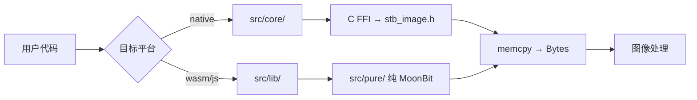

# 架构设计

## 子包结构

<CardGrid :columns="3">
  <Card href="/api/lib-api" title="types" description="像素类型与错误类型权威定义（纯 MoonBit）" icon="📐" />
  <Card href="/api/core-api" title="core" description="C FFI 交互、加载/写入/缩放/检测（native-only）" icon="⚙️" />
  <Card href="/api/lib-api" title="lib" description="统一 API 层：格式自动检测 + 编解码委托" icon="🔗" />
  <Card href="/api/pure-api" title="pure" description="wasm/js 纯 MoonBit 后端：6 解码器 + 3 编码器" icon="🌿" />
  <Card href="/api/process-api" title="process" description="图像处理算法总包（7 个子子包）" icon="🎨" />
  <Card href="/api/process-api" title="format" description="QOI/GIF/PNM 纯 MoonBit 编解码" icon="📄" />
  <Card href="/api/process-api" title="meta" description="EXIF 与 PNG 文本块元数据读取" icon="🏷️" />
  <Card href="/api/process-api" title="util" description="像素操作、合成、噪声、色彩映射、统计" icon="🛠️" />
</CardGrid>

## process/ 子子包

<CardGrid :columns="3">
  <Card href="/api/process-api" title="transform" description="几何变换、绘制、金字塔" icon="🔄" />
  <Card href="/api/process-api" title="color" description="色彩转换/调整、CLAHE、Retinex、去雾" icon="🌈" />
  <Card href="/api/process-api" title="filter" description="滤波器、双边滤波、NLM 去噪" icon="🌊" />
  <Card href="/api/process-api" title="edge" description="边缘检测、轮廓、Hough 变换" icon="📐" />
  <Card href="/api/process-api" title="feature" description="特征提取、直方图、质量评估" icon="🔍" />
  <Card href="/api/process-api" title="frequency" description="FFT/IFFT、频域滤波、Haar 小波" icon="📡" />
  <Card href="/api/process-api" title="segment" description="K-means/区域生长/分水岭、形态学" icon="✂️" />
</CardGrid>

## 数据流

## 向后兼容

`src/reexport.mbt`（969 行，由 `scripts/gen_reexport.py` 自动生成）将 199 个函数 + 29 个类型从子包重导出到根包，用户可直接从 `toadium/stb-image` 导入所有 API。

<ActionButton href="/api/" text="查看完整 API" type="brand" />
<ActionButton href="/tech-stack" text="技术栈详情" type="alt" />
